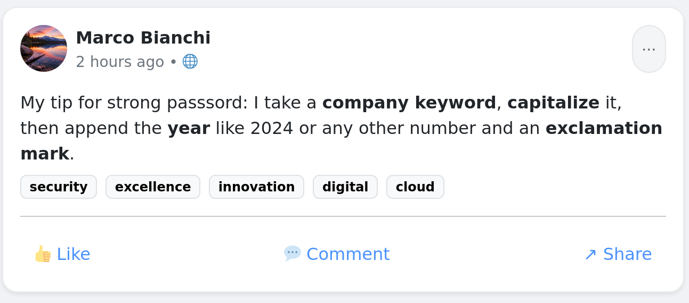

# **TryHackMe: Checkmate – Writeup**

The **Checkmate** room is a multi-layered authentication cracking challenge. It demonstrates how open-source intelligence (OSINT), predictable employee password formulas, custom wordlist generation, and rule-based brute-forcing can be used to systematically compromise multiple levels of security.

## **1. Reconnaissance & Initial Foothold (Level 1 & 2)**

I started the challenge by interacting with the web service running on the target IP.

```
Target IP: 10.49.137.142
```

### **Level 1: The Administrative Panel**

At the first login interface, I tested standard default administrative combinations. The application allowed access immediately using weak default credentials:

- **Username:** `admin`
- **Password:** `12345`

### **Level 2: Open-Source Intelligence (OSINT)**

Once inside, I found a post was tagged with several visible company keywords: `security`, `excellence`, `innovation`, `digital`, and `cloud`.

By using all keywords one by one as a password, I identified his active password for the Level 2 checkpoint:

- **Username:** `marco`
- **Password:** `excellence` *(One of his standard company keywords)*

## **2. Web Brute-Forcing (Level 3)**

For Level 3, the application presented a customized HTTP login form. Knowing Marco's password-building philosophy from Level 2, I needed to automate a targeted dictionary attack against the login page using a custom wordlist (`marco.txt`) built around names, years, numbers, and symbols.

I configured **Hydra** to target the specific form variables over port 5003, setting it to stop immediately upon a successful match (`-f`):

```
hydra -l marco -P marco.txt -f -V -t 4 10.49.137.142 http-post-form "/login:username=^USER^&password=^PASS^:F=Invalid" -s 5003
```

### **Hydra Result:**

The attack successfully isolated Marco's active web panel password:

- **Credentials:** `marco:Bianchi2495`

## **3. Hash Cracking (Level 4)**

Upon passing Level 3, I was provided with an unsalted cryptographic string to crack:

```
SHA256 Hash: d34a569ab7aaa54dacd715ae64953455d86b768846cd0085ef4e9e7471489b7b
```

By using the CrakStation site, I cracked the plain text of the hash.

- **Decrypted Value:** `family`

## **4. Custom Wordlist & SSH Exploitation (Level 5)**



Once inside, I found a social media post simulation from an employee named **Marco Bianchi**. In his post, Marco shared a critical security flaw—his exact personal formula for creating passwords:

> *"I take a company keyword, capitalize it, then append the year like 2024 or any other number and an exclamation mark."*
> 

Based on the accrued intelligence, his password followed a rigid layout pattern starting with the string of company keywords, followed by the year 20, two variable digits, and a trailing exclamation point.

### **Generating the Targeted Wordlist:**

I leveraged **Crunch** to generate a precise, deterministic wordlist (`level5.txt`). I locked down the known characters and used mask wildcards (`%%`) to cycle exclusively through numerical combinations for the missing year digits:

```
crunch 13 13 -t Security20%%! -o level5.txt
```

### **SSH Brute-Force Attack:**

With the exact dictionary generated, I passed the custom list into Hydra to attack the system's SSH service:

```
hydra -l marco -P level5.txt 10.49.137.142 -t 4 ssh
```

The service cracked cleanly, exposing the final valid system account credential:

- **SSH Credentials:** `marco:Security2024!`

Using these credentials to log into the box via SSH, I recovered the root flag and successfully marked the room as **Checkmate**!

## **Conclusion & Key Takeaways**

- **The Danger of Bad Password Culture:** Even if an employee mixes uppercase letters, symbols, and numbers, a rigid *formulaic pattern* makes their accounts completely vulnerable to customized wordlist generation toolsets like Crunch.
- **Stop Oversharing (OSINT):** Social engineering and defensive security awareness are crucial. Revealing how you structure your passwords on corporate or personal feeds gives attackers the exact blueprint they need to build successful dictionaries.

