# TryHackMe – Include CTF Walkthrough

After obtaining the IP address, I began port scanning using Nmap.

## Nmap Result:

```
─[dsk@parrot]─[~/THM/INCLUDE]
└──╼ $sudo nmap -A -v -T4 10.49.156.196

Scanning 10.49.156.196 [1000 ports]
Discovered open port 993/tcp on 10.49.156.196
Discovered open port 25/tcp on 10.49.156.196
Discovered open port 995/tcp on 10.49.156.196
Discovered open port 110/tcp on 10.49.156.196
Discovered open port 22/tcp on 10.49.156.196
Discovered open port 143/tcp on 10.49.156.196
Discovered open port 50000/tcp on 10.49.156.196
Discovered open port 4000/tcp on 10.49.156.196

Not shown: 992 closed tcp ports (reset)

PORT      STATE SERVICE  VERSION
22/tcp    open  ssh      OpenSSH 8.2p1 Ubuntu 4ubuntu0.11
25/tcp    open  smtp     Postfix smtpd
110/tcp   open  pop3     Dovecot pop3d
143/tcp   open  imap     Dovecot imapd
4000/tcp  open  http     Node.js (Express middleware)
50000/tcp open  http     Apache httpd 2.4.41 (Ubuntu)
```

From the scan results, I found that the web server is running on two ports: **4000** and **50000**.

---

## Web Enumeration – Port 4000

I began by accessing the website on port **4000**.

After visiting the webpage, I used the default credentials to log in.

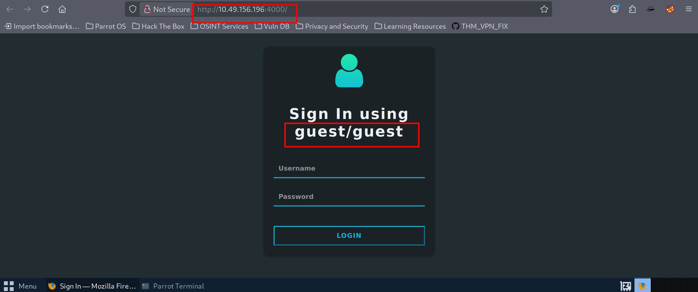


I clicked on the **View Profile** option. On that page, I saw two sections:

* **Friend Details**
* **Recommended Activity**

In the **Friend Details** section, the field `isAdmin` was set to `false`.

In the **Recommended Activity** section, there were two input fields:

* Activity Type
* Activity Name

I tried entering `test/test`, and it was reflected on the page.
Then, I changed the `isAdmin` field to `true`, and that worked as well.

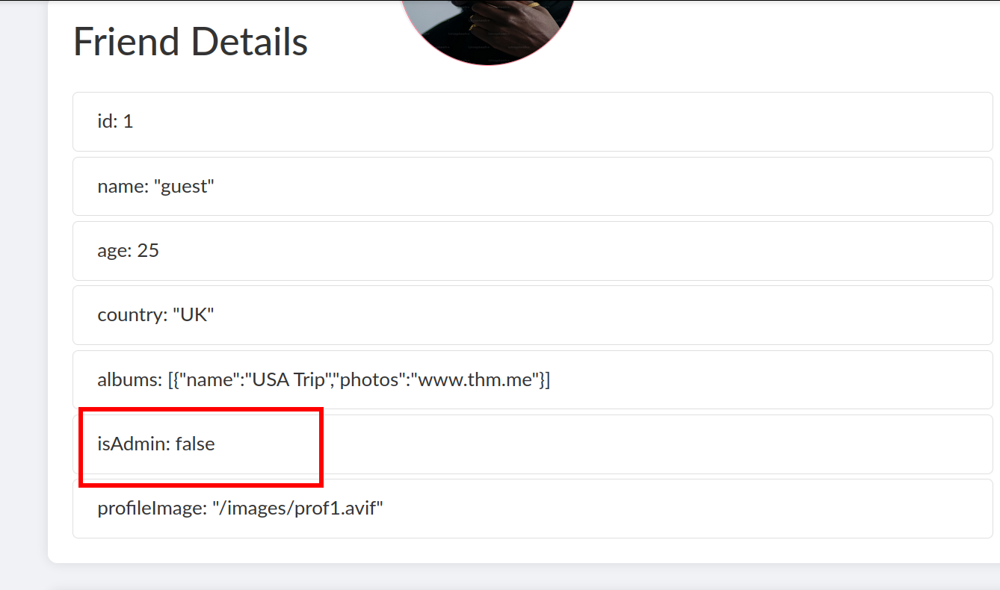
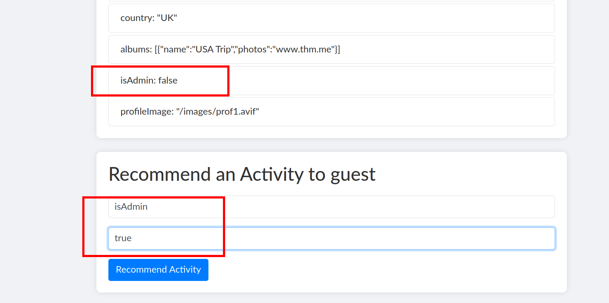
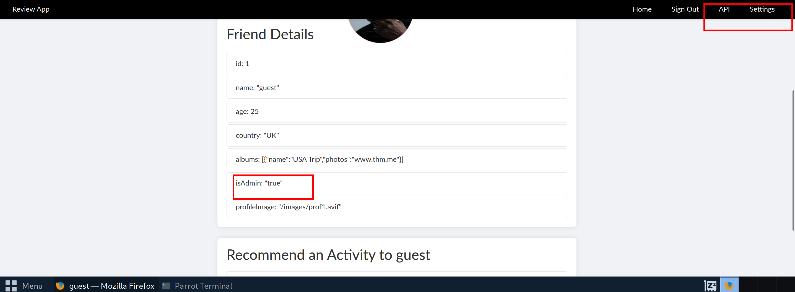

After setting `isAdmin` to `true`, two additional features became available:

* **API**
* **Settings**

---

## SSRF via Settings Page

On the **API** page, I observed some internal API requests.
On the **Settings** page, I noticed that the application accepts a **URL for an image**, downloads it, and then sets it as the banner.

This immediately suggested a possible **SSRF (Server-Side Request Forgery)** vulnerability.

I copied the Admin API request from the API page and pasted it into the banner URL field, which resulted in a **base64 encoded string**.

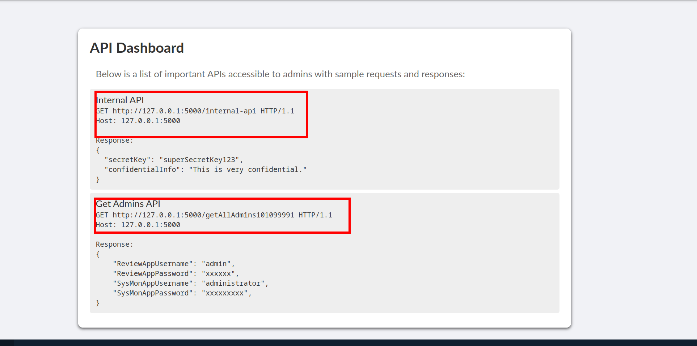
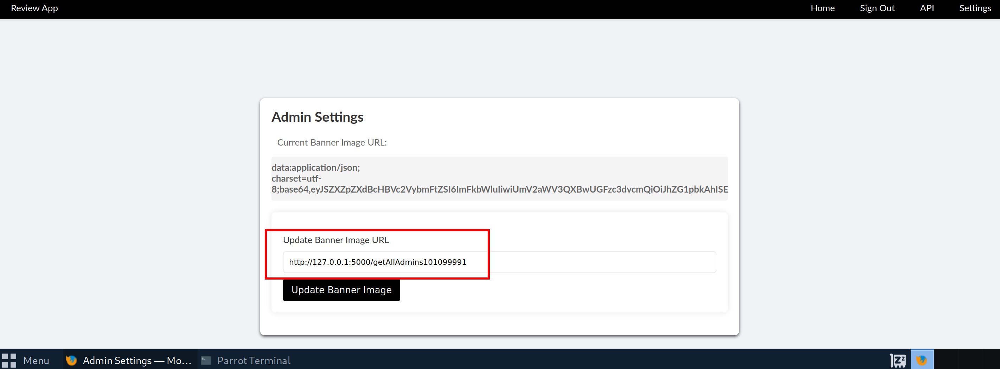
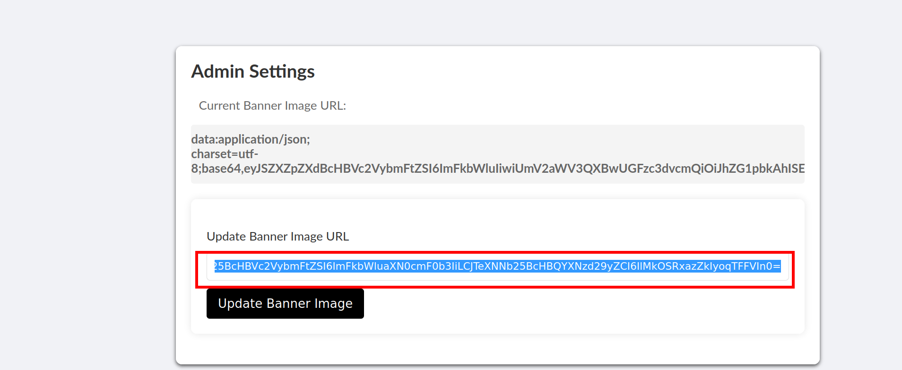

After decoding the string, I obtained usernames and passwords.

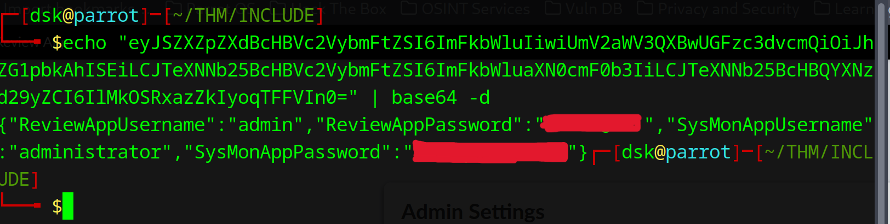

I tried using these credentials on the review app, but it didn’t work.

---

## SysMon Portal – Port 50000

Next, I accessed the **SysMon portal** running on port **50000** and logged in as an administrator.

I successfully obtained the **first flag** from the dashboard.

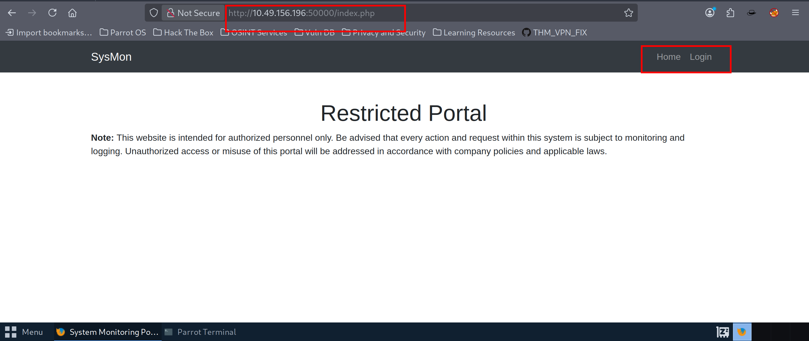
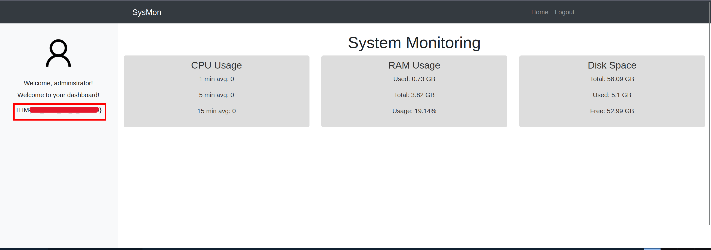

---

## LFI via img Parameter

After logging into the SysMon portal, I analyzed the page source and noticed the image source uses the `img=` parameter.

This suggested a possible **Local File Inclusion (LFI)** vulnerability.

I captured the request using **Caido** instead of Burp Suite, since Burp Community Edition has rate-limiting issues when brute-forcing LFI payloads.

I used the LFI wordlist from:
[https://github.com/danielmiessler/SecLists/blob/master/Fuzzing/LFI/LFI-Jhaddix.txt](https://github.com/danielmiessler/SecLists/blob/master/Fuzzing/LFI/LFI-Jhaddix.txt)

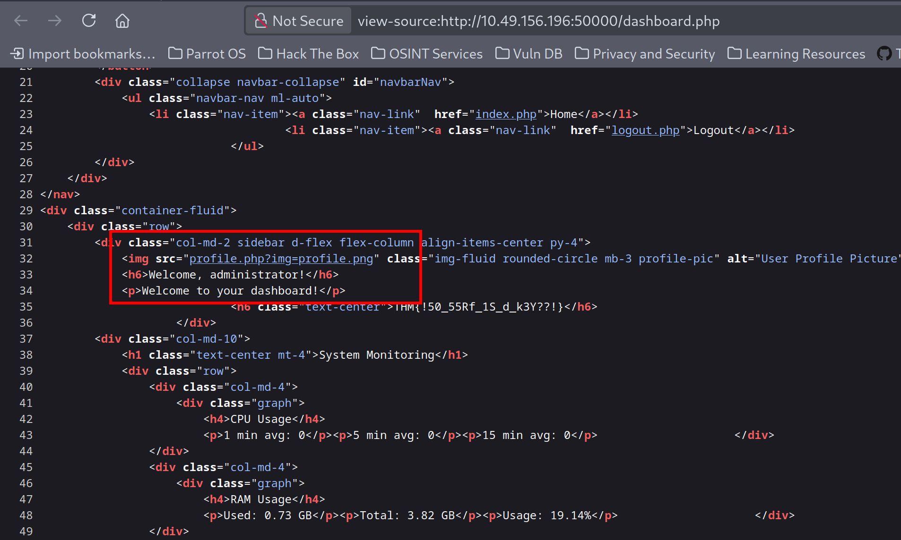

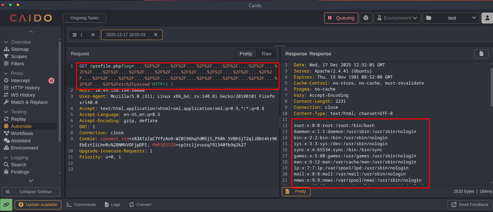

From the `/etc/passwd` file, I obtained two users:

```bash
joshua:x:1002:1002:,,,:/home/joshua:/bin/bash
charles:x:1003:1003:,,,:/home/charles:/bin/bash
```

---

## SSH Brute Force

I chose the user **joshua**.
From the Nmap scan, we know that **SSH (port 22)** is open.

I used **Hydra** to brute-force the password for the user and successfully obtained valid credentials.

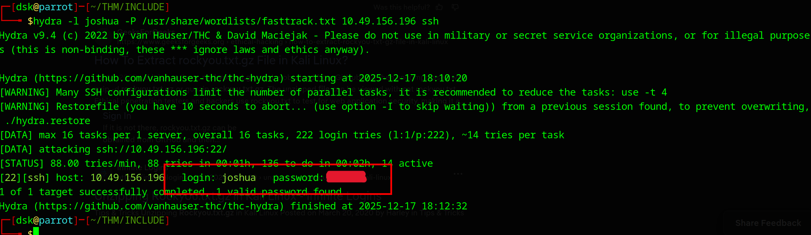

---

## Final Flag

After logging in via SSH, I navigated to the `/var/www/html` directory.

There, I found a suspicious file and discovered the **final flag**.

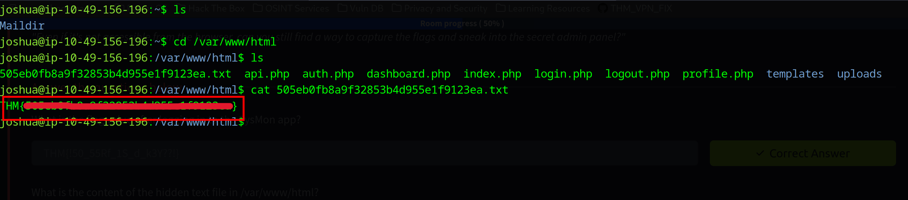

---